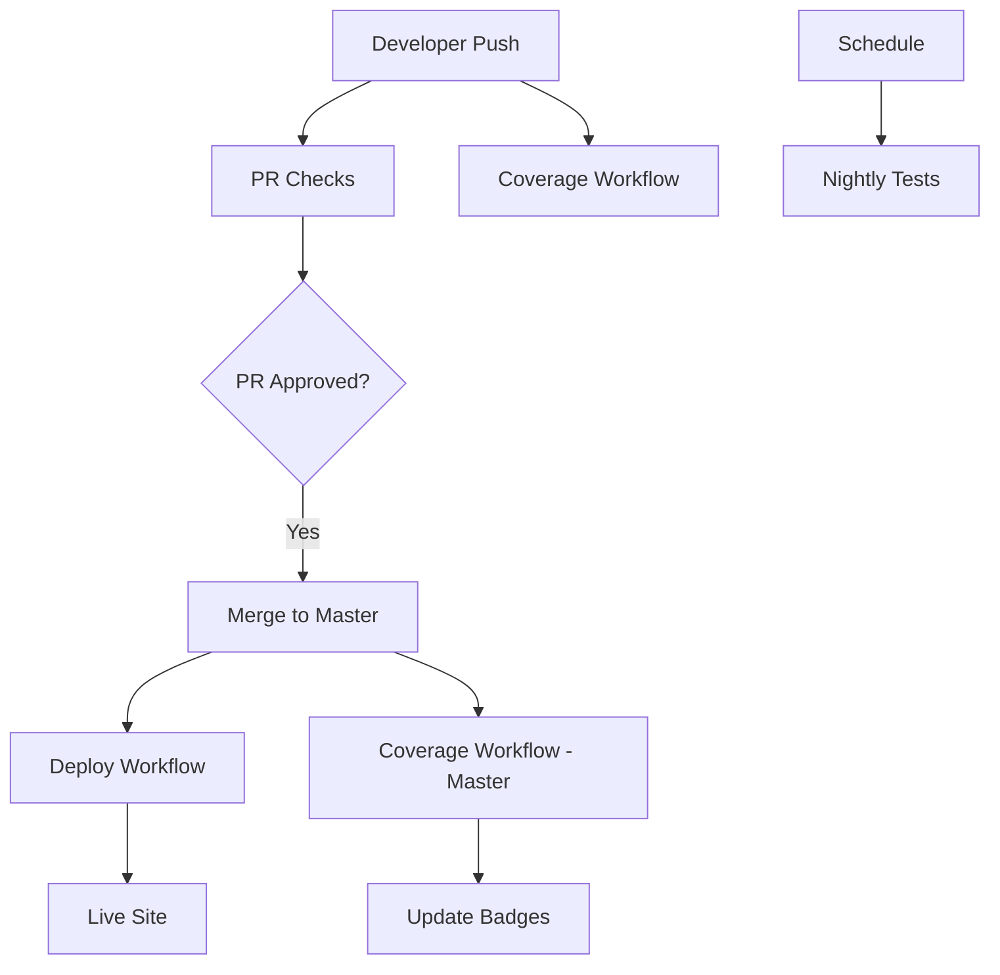

# GitHub Actions Workflow Structure

This document explains the GitHub Actions workflows and their responsibilities.

## Workflow Overview

### 🏗️ `pr-checks.yml` - Pull Request Validation

**Triggers:** PRs to master branch  
**Purpose:** Fast validation of code quality

**Jobs:**

- ✅ **Do Not Merge Check** - Validates PR labels
- ✅ **Build** - Ensures code compiles
- ✅ **Lint** - Code style and quality checks
- ✅ **Format** - Code formatting validation
- ✅ **Test** - Unit tests (without coverage for speed)
- ✅ **Typecheck** - TypeScript validation
- ✅ **Build Storybook** - Component library validation

**Philosophy:** Fast feedback for developers - runs essential checks quickly.

### 📊 `coverage.yml` - Coverage Analysis & Badges

**Triggers:** Push to master, PRs to master, manual dispatch  
**Purpose:** Comprehensive test coverage analysis

**Jobs:**

- ✅ **Coverage Tests** - Full test suite with coverage
- ✅ **Badge Generation** - Creates SVG coverage badges
- ✅ **Gist Upload** - Updates dynamic shields.io badges
- ✅ **Artifact Upload** - Stores coverage reports
- ✅ **PR Comments** - Posts coverage summary on PRs

**Philosophy:** Dedicated coverage workflow that runs independently from deployment.

### 🚀 `deploy.yml` - Production Deployment

**Triggers:** Push to master branch  
**Purpose:** Build and deploy to GitHub Pages

**Jobs:**

- ✅ **Build Application** - Production build
- ✅ **Build Storybook** - Component library
- ✅ **Deploy to Pages** - Publish to GitHub Pages

**Philosophy:** Clean deployment focused only on building and publishing.

### 🌙 `nightly-tests.yml` - Comprehensive E2E Testing

**Triggers:** Scheduled (nightly), manual dispatch  
**Purpose:** Full regression testing across browsers

**Jobs:**

- ✅ **Playwright Tests** - Cross-browser E2E tests
- ✅ **Visual Regression** - Screenshot comparisons
- ✅ **Performance Tests** - Load time validation

**Philosophy:** Comprehensive testing that doesn't block development.

## Workflow Dependencies

## Badge Update Flow

1. **PR Created** → Coverage workflow runs → PR comment with coverage
2. **PR Merged** → Coverage workflow runs → Badges updated in Gist
3. **README Badges** → Always show latest coverage from Gist

## Benefits of This Structure

### ✅ **Separation of Concerns**

- **PR Checks**: Fast validation for development
- **Coverage**: Dedicated coverage analysis
- **Deploy**: Clean production deployment
- **Nightly**: Comprehensive regression testing

### ✅ **Performance**

- PR checks run fast (no coverage overhead)
- Coverage analysis doesn't block deployment
- Deployment only builds what's needed

### ✅ **Reliability**

- Coverage badges update independently from deployment
- Failed coverage doesn't break deployment
- Each workflow has single responsibility

### ✅ **Developer Experience**

- Fast feedback on PRs
- Coverage details in PR comments
- Always up-to-date badges
- Clear workflow purposes

## Monitoring

### GitHub Actions Tabs

- **PR Checks**: Essential validations
- **Coverage**: Coverage reports and badges
- **Deploy**: Deployment status
- **Nightly**: E2E test results

### Badge Status

All badges in README show real-time status:

- **Build Status**: PR checks workflow
- **Deploy Status**: Deployment workflow
- **Coverage**: Coverage workflow (via Gist)
- **Nightly Tests**: Scheduled test results

## Maintenance

### Adding New Checks

- **Code Quality**: Add to `pr-checks.yml`
- **Coverage Related**: Add to `coverage.yml`
- **Build/Deploy**: Add to `deploy.yml`
- **E2E Testing**: Add to `nightly-tests.yml`

### Secrets Required

- `GITHUB_TOKEN`: Automatic (GitHub provides)
- `COVERAGE_GIST_ID`: Manual setup for badges

This structure provides a clean, maintainable CI/CD pipeline with clear responsibilities and optimal performance.
