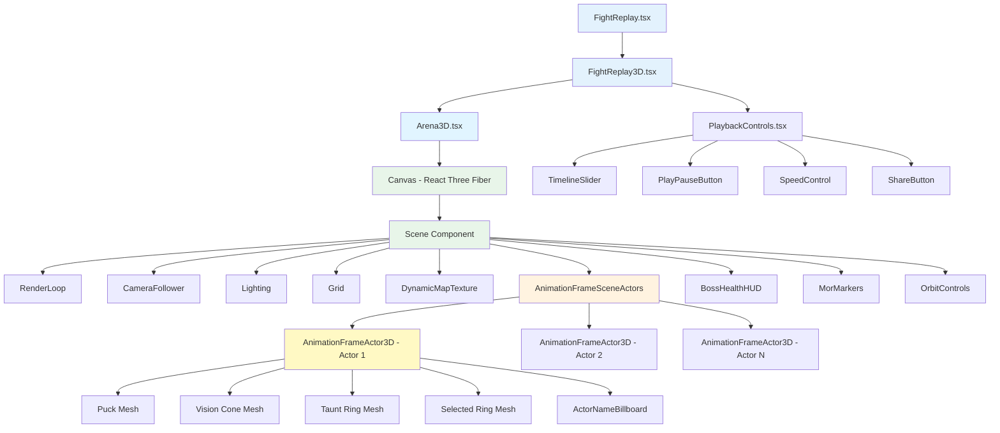
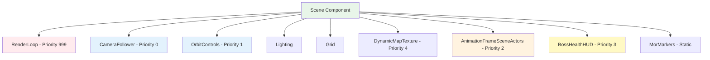
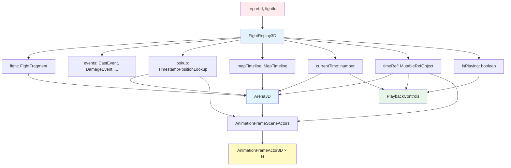

# Component Hierarchy

**Last Updated**: October 14, 2025  
**Status**: Living Document  
**Related**: [System Architecture](./system-architecture.md) | [Data Flow](./data-flow.md) | [Worker Dependencies](./worker-dependencies.md)

---

## Overview

This document visualizes the React component tree for the Fight Replay system, showing component relationships, prop flow, and React Three Fiber (R3F) rendering priorities.

---

## Complete Component Tree



---

## Layer 1: Presentation Components

### FightReplay.tsx

**Purpose**: Entry point and layout container

**Responsibilities**:
- Route parameter parsing (`reportId`, `fightId`)
- Overall page layout
- Error boundary (recommended addition)

**Props**: None (uses React Router params)

**Children**: 
- `FightReplay3D` - Main orchestrator

**File**: `src/features/fight_replay/FightReplay.tsx`

```typescript
export const FightReplay: React.FC = () => {
  const { reportId, fightId } = useParams();
  
  return (
    <Box sx={{ height: '100vh', display: 'flex', flexDirection: 'column' }}>
      <FightReplay3D reportId={reportId!} fightId={fightId!} />
    </Box>
  );
};
```

---

### FightReplay3D.tsx

**Purpose**: Data fetching and worker task orchestration

**Responsibilities**:
- GraphQL queries for fight and events
- Worker task initialization
- Redux state management
- Deep linking (URL state)
- Loading/error states

**Props**:
```typescript
interface FightReplay3DProps {
  reportId: string;
  fightId: string;
}
```

**Key State**:
```typescript
// GraphQL data
const fight = useFight(reportId, fightId);
const castEvents = useCastEvents(reportId, fightId);
const damageEvents = useDamageEvents(reportId, fightId);
// ... other event hooks

// Worker results (from Redux)
const lookup = useSelector(selectActorPositionsData);
const loading = useSelector(selectActorPositionsLoading);

// Playback state
const [currentTime, setCurrentTime] = useState(0);
const [isPlaying, setIsPlaying] = useState(false);
const [playbackSpeed, setPlaybackSpeed] = useState(1);
const [followingActorId, setFollowingActorId] = useState<string | null>(null);
```

**Children**:
- `Arena3D` - 3D scene container
- `PlaybackControls` - UI controls

**File**: `src/features/fight_replay/components/FightReplay3D.tsx`

---

### PlaybackControls.tsx

**Purpose**: Timeline and playback UI controls

**Responsibilities**:
- Timeline scrubbing
- Play/pause button
- Playback speed selector
- Actor following controls
- Share URL button
- Time display

**Props**:
```typescript
interface PlaybackControlsProps {
  duration: number;
  currentTime: number;
  onTimeChange: (time: number) => void;
  isPlaying: boolean;
  onPlayingChange: (playing: boolean) => void;
  playbackSpeed: number;
  onSpeedChange: (speed: number) => void;
  followingActorId: string | null;
  onActorFollow: (actorId: string | null) => void;
  actors: ActorInfo[];
  timeRef: React.MutableRefObject<number>;  // ⭐ For optimized scrubbing
}
```

**Key Hooks**:
```typescript
// Optimized timeline scrubbing
useOptimizedTimelineScrubbing({
  duration,
  currentTime,
  onTimeChange,
  isPlaying,
  onPlayingChange,
  timeRef,  // Updates immediately during drag
});
```

**Children**:
- `TimelineSlider` (MUI Slider)
- `PlayPauseButton`
- `SpeedControl` (Select dropdown)
- `ActorFollowSelect`
- `ShareButton`

**File**: `src/features/fight_replay/components/PlaybackControls.tsx`

---

## Layer 2: 3D Scene Container

### Arena3D.tsx

**Purpose**: React Three Fiber Canvas wrapper and scene setup

**Responsibilities**:
- Canvas configuration
- Camera setup
- Scene scaling
- Dynamic arena sizing
- Props distribution to scene children

**Props**:
```typescript
interface Arena3DProps {
  fight: FightFragment;
  lookup: TimestampPositionLookup;
  mapTimeline: MapTimeline;
  buffLookup?: BuffLookupData;
  debuffLookup?: DebuffLookupData;
  currentTime: number;  // React state (low-frequency)
  timeRef: React.MutableRefObject<number>;  // Animation ref (high-frequency)
  followingActorId: string | null;
  onActorClick: (actorId: string) => void;
  morMarkersString?: string;
}
```

**Key Calculations**:
```typescript
// Dynamic arena sizing based on fight bounding box
const arenaDimensions = useMemo(() => {
  const { minX, maxX, minY, maxY } = fight.boundingBox;
  const rangeX = maxX - minX;
  const rangeZ = maxY - minY;
  const size = Math.max(rangeX, rangeZ) * 1.2;  // 20% padding
  
  // Calculate optimal camera distance for FOV
  const fov = 30;
  const viewDistance = (size / 2) / Math.tan((fov * Math.PI) / 360);
  
  return {
    size,
    centerX: (minX + maxX) / 2,
    centerZ: (minY + maxY) / 2,
    cameraDistance: viewDistance,
    scale: size / 100  // Normalize scale
  };
}, [fight]);
```

**Canvas Configuration**:
```typescript
<Canvas
  camera={{
    position: [centerX, cameraDistance, centerZ + cameraDistance],
    fov: 30,
    near: 0.1,
    far: 10000
  }}
  gl={{
    antialias: true,
    alpha: true,
    powerPreference: "high-performance"
  }}
  frameloop="demand"  // ⭐ Manual rendering via RenderLoop
>
  <Scene {...props} />
</Canvas>
```

**File**: `src/features/fight_replay/components/Arena3D.tsx` (633 lines - candidate for refactoring)

---

## Layer 3: React Three Fiber Scene

### Scene Component (Inline in Arena3D)

**Purpose**: Container for all 3D objects with proper render ordering

**Children (in render priority order)**:



---

### RenderLoop Component

**Purpose**: Manual render control for performance optimization

**Priority**: 999 (RENDER - executes LAST)

**Responsibilities**:
- Force render on every frame
- Ensure consistent frame timing

```typescript
const RenderLoop = () => {
  useFrame(({ gl, scene, camera }) => {
    gl.render(scene, camera);
  }, RenderPriority.RENDER);  // 999
  
  return null;
};
```

**Why Manual Rendering?**:
- Precise control over when frames render
- Avoid unnecessary renders
- Coordinate with other `useFrame` hooks

**File**: `src/features/fight_replay/components/Arena3D.tsx`

---

### CameraFollower Component

**Purpose**: Smooth camera following of selected actor

**Priority**: 0 (FOLLOWER_CAMERA - executes FIRST)

**Responsibilities**:
- Track followed actor position
- Smooth camera interpolation (lerp)
- Maintain camera offset
- Lock/unlock OrbitControls

```typescript
export const CameraFollower = ({
  followingActorIdRef,
  lookup,
  timeRef,
  ...
}) => {
  const { camera } = useThree();
  const targetPositionRef = useRef(new THREE.Vector3());
  
  useFrame(() => {
    if (!followingActorIdRef.current) return;
    
    // Get actor position at current time
    const actorPosition = getActorPositionAtClosestTimestamp(
      lookup,
      followingActorIdRef.current,
      timeRef.current
    );
    
    if (actorPosition) {
      const [x, y, z] = actorPosition.position;
      const newTarget = new THREE.Vector3(x, y, z);
      
      // Smooth lerp to target
      targetPositionRef.current.lerp(newTarget, smoothingFactor);
      
      // Calculate desired camera position
      const offset = new THREE.Vector3(0, cameraHeight, cameraDistance);
      const desiredCameraPosition = targetPositionRef.current.clone().add(offset);
      
      // Smooth camera movement
      camera.position.lerp(desiredCameraPosition, smoothingFactor);
      camera.lookAt(targetPositionRef.current);
    }
  }, RenderPriority.FOLLOWER_CAMERA);  // Priority 0 - executes FIRST
  
  return null;
};
```

**File**: `src/features/fight_replay/components/CameraFollower.tsx`

---

### Lighting Components

**Purpose**: Scene illumination

**Components**:
- `<ambientLight>` - Soft ambient lighting
- `<directionalLight>` - Main light source with shadows
- `<hemisphereLight>` - Sky/ground color

```typescript
<ambientLight intensity={0.5} />
<directionalLight
  position={[50, 100, 50]}
  intensity={1}
  castShadow
  shadow-mapSize-width={2048}
  shadow-mapSize-height={2048}
/>
<hemisphereLight args={[0xffffff, 0x444444, 0.6]} />
```

---

### Grid Component

**Purpose**: Visual reference grid on arena floor

```typescript
<gridHelper
  args={[arenaSize, 50, 0x888888, 0x444444]}
  position={[centerX, 0, centerZ]}
/>
```

---

### DynamicMapTexture Component

**Purpose**: Display map texture that changes based on fight phases

**Priority**: 4 (EFFECTS)

**Responsibilities**:
- Load map textures from mapTimeline
- Switch textures on phase changes
- Cache loaded textures
- Apply texture to floor plane

```typescript
export const DynamicMapTexture = ({
  mapTimeline,
  timeRef,
  fight,
  scale,
  centerX,
  centerZ
}) => {
  const materialRef = useRef<THREE.MeshBasicMaterial>(null);
  const currentMapFileRef = useRef<string | null>(null);
  const textureCache = useRef(new Map<string, THREE.Texture>());
  
  useFrame(() => {
    const currentTime = timeRef.current;
    const timestamp = fightTimeToTimestamp(fight, currentTime);
    
    // Get map for current time
    const mapEntry = getMapAtTimestamp(mapTimeline, timestamp);
    
    if (mapEntry?.mapFile && mapEntry.mapFile !== currentMapFileRef.current) {
      // Load texture (with caching)
      loadTexture(mapEntry.mapFile, textureCache.current).then(texture => {
        if (materialRef.current) {
          materialRef.current.map = texture;
          materialRef.current.needsUpdate = true;
        }
      });
      
      currentMapFileRef.current = mapEntry.mapFile;
    }
  }, RenderPriority.EFFECTS);  // Priority 4
  
  return (
    <mesh position={[centerX, -0.1, centerZ]} rotation={[-Math.PI / 2, 0, 0]}>
      <planeGeometry args={[arenaSize, arenaSize]} />
      <meshBasicMaterial ref={materialRef} transparent opacity={0.5} />
    </mesh>
  );
};
```

**File**: `src/features/fight_replay/components/DynamicMapTexture.tsx`

---

### AnimationFrameSceneActors Component

**Purpose**: Render all actors in the fight

**Priority**: 2 (ACTORS) - via individual AnimationFrameActor3D components

**Responsibilities**:
- Create shared geometries (once)
- Map actors to AnimationFrameActor3D components
- Pass shared geometries to all actors

```typescript
export const AnimationFrameSceneActors = ({
  lookup,
  timeRef,
  scale,
  selectedActorRef,
  onActorClick
}) => {
  // ⭐ Create shared geometries ONCE for ALL actors
  const sharedGeometries = useSharedActor3DGeometries(scale);
  
  // Get all unique actor IDs from lookup
  const actorIds = useMemo(() => {
    const ids = new Set<string>();
    Object.values(lookup.positionsByTimestamp).forEach(positions => {
      Object.keys(positions).forEach(id => ids.add(id));
    });
    return Array.from(ids);
  }, [lookup]);
  
  return (
    <>
      {actorIds.map(actorId => (
        <AnimationFrameActor3D
          key={actorId}
          actorId={actorId}
          lookup={lookup}
          timeRef={timeRef}
          scale={scale}
          sharedGeometries={sharedGeometries}  // ⭐ Shared!
          selectedActorRef={selectedActorRef}
          onActorClick={onActorClick}
          showName={true}
        />
      ))}
    </>
  );
};
```

**File**: `src/features/fight_replay/components/AnimationFrameSceneActors.tsx`

---

### AnimationFrameActor3D Component ⭐

**Purpose**: Render individual actor with position updates at 60fps

**Priority**: 2 (ACTORS)

**Responsibilities**:
- Query position at current time
- Update THREE.js objects directly (no React re-renders)
- Handle visibility (dead actors, out of range)
- Display actor visuals (puck, vision cone, taunt ring)
- Actor selection handling

**Props**:
```typescript
interface AnimationFrameActor3DProps {
  actorId: string;
  lookup: TimestampPositionLookup;
  timeRef: React.MutableRefObject<number>;
  scale: number;
  sharedGeometries: SharedGeometries;  // ⭐ From parent
  selectedActorRef: React.MutableRefObject<string | null>;
  onActorClick: (actorId: string) => void;
  showName: boolean;
}
```

**Refs (for direct THREE.js manipulation)**:
```typescript
const groupRef = useRef<THREE.Group>(null);
const puckMaterialRef = useRef<THREE.MeshBasicMaterial>(null);
const visionConeMaterialRef = useRef<THREE.MeshBasicMaterial>(null);
const tauntRingMaterialRef = useRef<THREE.MeshBasicMaterial>(null);
const currentActorDataRef = useRef<ActorPosition | null>(null);
const isVisibleRef = useRef(false);
```

**Core Update Loop**:
```typescript
useFrame(() => {
  const currentTime = timeRef.current;
  
  // O(1) or O(log n) position lookup
  const actorData = getActorPositionAtClosestTimestamp(
    lookup,
    actorId,
    currentTime
  );
  
  if (!actorData) {
    // Actor doesn't exist at this time
    isVisibleRef.current = false;
    if (groupRef.current) groupRef.current.visible = false;
    return;
  }
  
  // Update position (direct THREE.js, NO React re-render)
  const [x, y, z] = actorData.position;
  if (groupRef.current) {
    groupRef.current.position.set(x, y, z);
    groupRef.current.rotation.y = actorData.rotation;
    groupRef.current.visible = true;
  }
  
  // Update colors based on state
  const color = getActorColor(actorData);
  if (puckMaterialRef.current) {
    puckMaterialRef.current.color.set(color);
  }
  
  // Show/hide taunt ring
  if (tauntRingMaterialRef.current) {
    tauntRingMaterialRef.current.visible = actorData.isTaunted;
  }
  
  // Update selection ring
  const isSelected = selectedActorRef.current === actorId;
  if (selectedRingMaterialRef.current) {
    selectedRingMaterialRef.current.visible = isSelected;
  }
  
  currentActorDataRef.current = actorData;
  isVisibleRef.current = true;
  
}, RenderPriority.ACTORS);  // Priority 2
```

**Visual Components**:
```typescript
return (
  <group ref={groupRef} onClick={() => onActorClick(actorId)}>
    {/* Main actor body (cylinder) */}
    <mesh geometry={sharedGeometries.puckGeometry}>
      <meshBasicMaterial ref={puckMaterialRef} />
    </mesh>
    
    {/* Directional indicator (cone) */}
    <mesh geometry={sharedGeometries.visionConeGeometry}>
      <meshBasicMaterial ref={visionConeMaterialRef} />
    </mesh>
    
    {/* Taunt ring (torus) */}
    <mesh geometry={sharedGeometries.tauntRingGeometry}>
      <meshBasicMaterial ref={tauntRingMaterialRef} visible={false} />
    </mesh>
    
    {/* Selection ring */}
    <mesh geometry={sharedGeometries.selectedRingGeometry}>
      <meshBasicMaterial ref={selectedRingMaterialRef} visible={false} />
    </mesh>
    
    {/* Actor name billboard */}
    {showName && (
      <ActorNameBillboard
        name={currentActorDataRef.current?.name || actorId}
        scale={scale}
      />
    )}
  </group>
);
```

**File**: `src/features/fight_replay/components/AnimationFrameActor3D.tsx`

---

### SharedActor3DGeometries Hook

**Purpose**: Create geometries once, share across all actors (95% memory reduction)

**Geometries Created**:
- `puckGeometry` - CylinderGeometry for actor body
- `visionConeGeometry` - ConeGeometry for direction indicator
- `tauntRingGeometry` - TorusGeometry for taunt visualization
- `selectedRingGeometry` - TorusGeometry for selection highlight

```typescript
export function useSharedActor3DGeometries(scale: number) {
  return useMemo(() => {
    const puckRadius = 1 * scale;
    const puckHeight = 2 * scale;
    
    return {
      puckGeometry: new THREE.CylinderGeometry(
        puckRadius, puckRadius, puckHeight, 32
      ),
      visionConeGeometry: new THREE.ConeGeometry(
        puckRadius * 0.8, puckHeight * 0.6, 16
      ),
      tauntRingGeometry: new THREE.TorusGeometry(
        puckRadius * 1.5, puckRadius * 0.2, 16, 32
      ),
      selectedRingGeometry: new THREE.TorusGeometry(
        puckRadius * 1.8, puckRadius * 0.15, 16, 32
      )
    };
  }, [scale]);
}
```

**Memory Impact**:
- **Without sharing**: 50 actors × 4 geometries = 200 geometry instances
- **With sharing**: 1 cache × 4 geometries = 4 geometry instances
- **Savings**: ~95% reduction!

**File**: `src/features/fight_replay/components/SharedActor3DGeometries.ts`

---

### BossHealthHUD Component

**Purpose**: Display boss health bars in screen space (2D overlay in 3D scene)

**Priority**: 3 (HUD)

**Responsibilities**:
- Find all bosses at current time
- Render health bars using canvas texture
- Position in screen space (top-right)
- Auto-hide dead bosses

```typescript
export const BossHealthHUD = ({ lookup, timeRef, fight }) => {
  const canvasRef = useRef<HTMLCanvasElement>(null);
  const textureRef = useRef<THREE.CanvasTexture | null>(null);
  
  useFrame(({ camera, size }) => {
    const currentTime = timeRef.current;
    const timestamp = fightTimeToTimestamp(fight, currentTime);
    
    // Get all actors at this time
    const allActors = getAllActorPositionsAtTimestamp(lookup, timestamp);
    
    // Filter to bosses that are alive
    const bosses = allActors.filter(
      actor => actor.type === 'boss' && !actor.isDead
    );
    
    if (bosses.length > 0 && canvasRef.current) {
      const ctx = canvasRef.current.getContext('2d')!;
      
      // Clear canvas
      ctx.clearRect(0, 0, canvasRef.current.width, canvasRef.current.height);
      
      // Draw each boss health bar
      bosses.forEach((boss, index) => {
        const y = 50 + index * 80;
        drawHealthBar(ctx, boss, y);
      });
      
      // Update texture
      if (textureRef.current) {
        textureRef.current.needsUpdate = true;
      }
    }
  }, RenderPriority.HUD);  // Priority 3
  
  return (
    <sprite position={[screenRight, screenTop, 0]}>
      <spriteMaterial map={textureRef.current} transparent />
    </sprite>
  );
};
```

**File**: `src/features/fight_replay/components/BossHealthHUD.tsx`

---

### MorMarkers Component

**Purpose**: Display static M0R Markers (community format) in 3D space

**Priority**: None (static, no useFrame)

**Responsibilities**:
- Decode M0R Markers string
- Transform coordinates based on zone
- Render marker icons/shapes

```typescript
export const MorMarkers = ({
  encodedString,
  fight,
  scale
}) => {
  const markers = useMemo(() => 
    decodeMorMarkersString(encodedString),
    [encodedString]
  );
  
  return (
    <>
      {markers.map(marker => (
        <Marker3D
          key={marker.id}
          marker={marker}
          fight={fight}
          scale={scale}
        />
      ))}
    </>
  );
};
```

**File**: `src/features/fight_replay/components/MorMarkers.tsx`

---

## Render Priority System

```typescript
// src/features/fight_replay/constants/renderPriorities.ts

export enum RenderPriority {
  FOLLOWER_CAMERA = 0,  // Camera updates FIRST
  CAMERA = 1,           // OrbitControls
  ACTORS = 2,           // Actor positions
  HUD = 3,              // Boss health, overlays
  EFFECTS = 4,          // Map textures, particles
  RENDER = 999          // Manual render call LAST
}
```

**Execution Order**:
```
Frame Start
  ↓
CameraFollower (Priority 0) - Update camera to follow actor
  ↓
OrbitControls (Priority 1) - Handle user camera input
  ↓
AnimationFrameActor3D × N (Priority 2) - Update all actor positions
  ↓
BossHealthHUD (Priority 3) - Render boss health bars
  ↓
DynamicMapTexture (Priority 4) - Update map texture if needed
  ↓
RenderLoop (Priority 999) - Final render to screen
  ↓
Frame End
```

**Why Priority Matters**:
- Camera must update before rendering actors (correct viewpoint)
- Actors must update before HUD (HUD uses actor data)
- Manual render ensures everything is ready before display

---

## Custom Hooks Used

### Animation & Time Management
- `useAnimationTimeRef` - Dual time system (ref + state)
- `usePlaybackAnimation` - requestAnimationFrame playback loop
- `useScrubbingMode` - Optimize rendering during scrubbing
- `useOptimizedTimelineScrubbing` - Debounced timeline updates

### Data Fetching
- `useFight` - GraphQL fight query
- `useCastEvents` - GraphQL cast events query
- `useDamageEvents` - GraphQL damage events query
- `useHealingEvents` - GraphQL healing events query
- `useResourceEvents` - GraphQL resource events query
- `useDeathEvents` - GraphQL death events query
- `useBuffEvents` - GraphQL buff events query

### Worker Tasks
- `useActorPositionsTask` - Calculate position interpolation
- `useBuffLookupTask` - Build buff lookup table
- `useDebuffLookupTask` - Build debuff lookup table

### Phase & Map
- `usePhaseBasedMap` - Create map timeline from phases

### Shared Resources
- `useSharedActor3DGeometries` - Create shared 3D geometries

---

## Props Flow Summary



---

## Component Complexity Analysis

| Component | Lines of Code | Complexity | Refactoring Priority |
|-----------|---------------|------------|---------------------|
| FightReplay.tsx | ~50 | Low | None |
| FightReplay3D.tsx | ~400 | High | Medium (extract hooks) |
| Arena3D.tsx | ~633 | Very High | **High** (extract Scene) |
| PlaybackControls.tsx | ~300 | Medium | Low (already well-structured) |
| AnimationFrameActor3D.tsx | ~200 | Medium | Low |
| CameraFollower.tsx | ~150 | Medium | None |
| DynamicMapTexture.tsx | ~100 | Low | None |
| BossHealthHUD.tsx | ~250 | Medium | Low |

**Recommendation**: Extract Scene component from Arena3D.tsx to reduce complexity (Story ESO-370)

---

## Testing Strategy

### Unit Tests
- ✅ Custom hooks (useAnimationTimeRef, etc.)
- ✅ Utility functions (getActorPositionAtClosestTimestamp)
- ⚠️ Component rendering (limited)

### Integration Tests (Recommended)
- ❌ FightReplay3D data flow
- ❌ Arena3D → AnimationFrameActor3D props
- ❌ Timeline scrubbing end-to-end

### E2E Tests
- ✅ Fight replay page loads
- ✅ Playback controls work
- ⚠️ 3D rendering validation

---

## Related Documentation

- [System Architecture](./system-architecture.md) - Overall system design
- [Data Flow](./data-flow.md) - Complete data flow visualization
- [Worker Dependencies](./worker-dependencies.md) - Worker task relationships
- [Performance Patterns](./performance-patterns.md) - Optimization techniques

---

**For Implementation**: See `src/features/fight_replay/` directory
