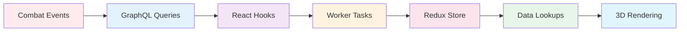
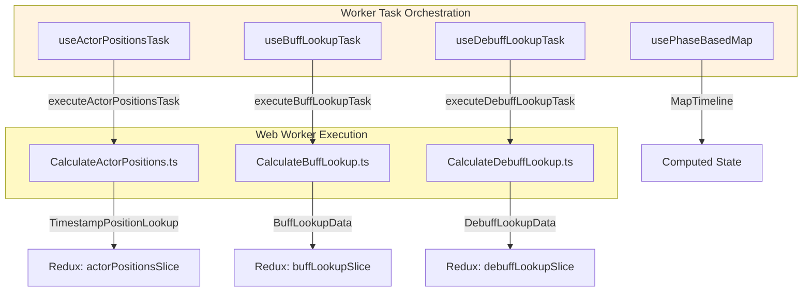
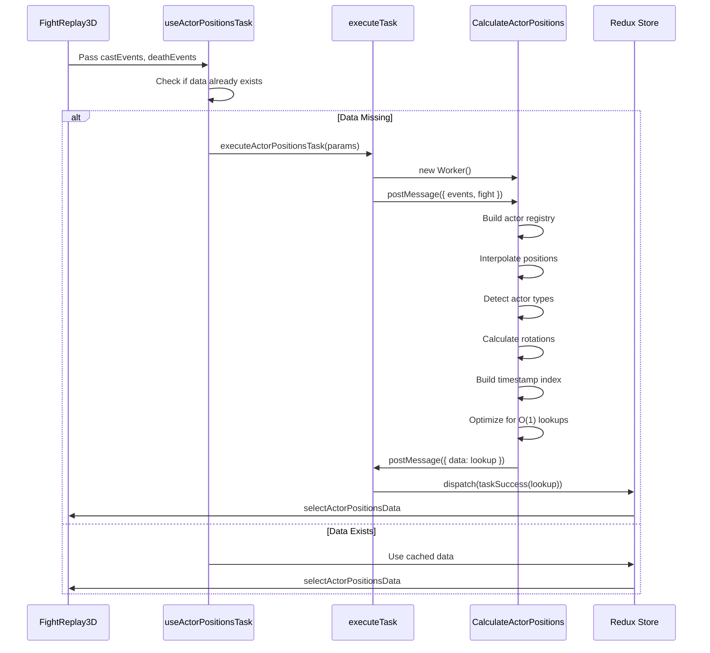
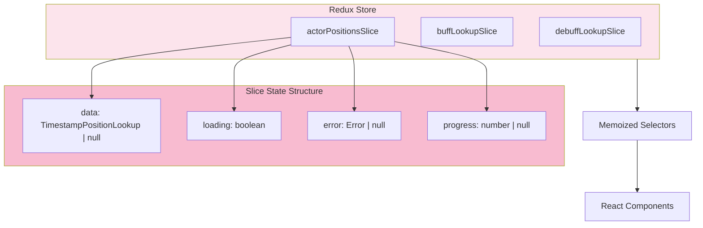
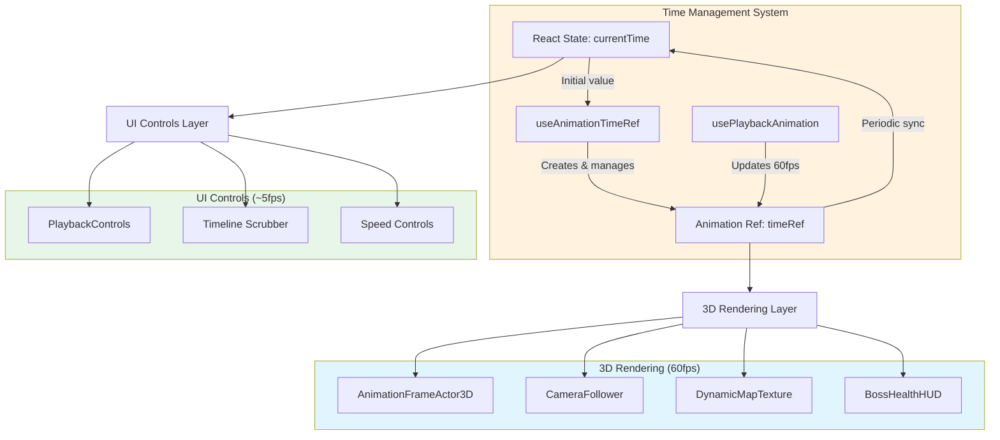
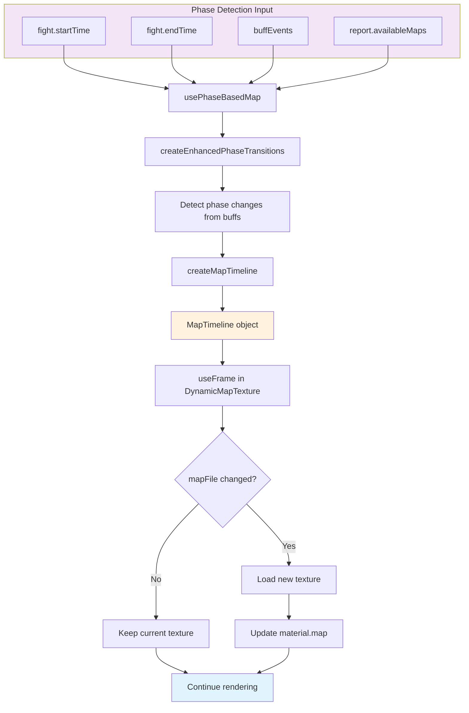

# Replay System Data Flow

**Last Updated**: October 14, 2025  
**Status**: Living Document  
**Related**: [System Architecture](./system-architecture.md) | [Worker Dependencies](./worker-dependencies.md) | [Component Hierarchy](./component-hierarchy.md)

---

## Overview

This document visualizes the complete data flow through the Fight Replay system, from raw combat events to rendered 3D visualization. Understanding this flow is critical for debugging, optimization, and feature development.

---

## High-Level Data Flow



---

## Detailed Event-to-Render Pipeline

### Phase 1: Data Ingestion

```mermaid
flowchart TD
    subgraph GraphQL["GraphQL Layer"]
        A1[useCastEvents]
        A2[useDamageEvents]
        A3[useHealingEvents]
        A4[useResourceEvents]
        A5[useDeathEvents]
        A6[useBuffEvents]
    end
    
    subgraph Events["Event Collections"]
        B1[castEvents: CastEvent[]]
        B2[damageEvents: DamageEvent[]]
        B3[healingEvents: HealingEvent[]]
        B4[resourceEvents: ResourceEvent[]]
        B5[deathEvents: DeathEvent[]]
        B6[buffEvents: BuffEvent[]]
    end
    
    A1 --> B1
    A2 --> B2
    A3 --> B3
    A4 --> B4
    A5 --> B5
    A6 --> B6
    
    B1 --> C[Worker Tasks]
    B2 --> C
    B3 --> C
    B4 --> C
    B5 --> C
    B6 --> C
    
    style GraphQL fill:#e3f2fd
    style Events fill:#f3e5f5
```

**Hook Locations**:
- `src/hooks/useReportEvents.ts` - Central event query hooks
- `src/features/fight_replay/components/FightReplay3D.tsx` - Hook invocations

**Event Types**:
```typescript
interface CastEvent {
  id: string;
  timestamp: number;
  sourceActorId: string;
  targetActorId?: string;
  abilityId: number;
  x?: number;  // Position data
  y?: number;
  z?: number;
}

// Similar interfaces for DamageEvent, HealingEvent, etc.
```

---

### Phase 2: Worker Task Execution



#### Actor Positions Task Flow



**Key Computation Steps**:

1. **Actor Registry Building**:
```typescript
const actorRegistry = new Map<actorId, ActorMetadata>();

for (const event of castEvents) {
  if (!actorRegistry.has(event.sourceActorId)) {
    actorRegistry.set(event.sourceActorId, {
      id: event.sourceActorId,
      name: event.sourceActorName,
      type: detectActorType(event),  // player/boss/add
      firstSeen: event.timestamp,
      lastSeen: event.timestamp
    });
  }
}
```

2. **Position Interpolation**:
```typescript
// For each timestamp (100ms intervals)
for (let t = fightStart; t <= fightEnd; t += SAMPLE_INTERVAL) {
  const positions: Record<actorId, ActorPosition> = {};
  
  for (const actor of actors) {
    // Find nearest cast events before/after this time
    const before = findEventBefore(actor, t);
    const after = findEventAfter(actor, t);
    
    if (before && after) {
      // Linear interpolation between events
      const ratio = (t - before.timestamp) / (after.timestamp - before.timestamp);
      const x = lerp(before.x, after.x, ratio);
      const y = lerp(before.y, after.y, ratio);
      const z = lerp(before.z, after.z, ratio);
      
      positions[actor.id] = { position: [x, y, z], ... };
    }
  }
  
  lookup.positionsByTimestamp[t] = positions;
}
```

3. **Index Optimization**:
```typescript
// Check if timestamps are evenly spaced
const intervals = [];
for (let i = 1; i < sortedTimestamps.length; i++) {
  intervals.push(sortedTimestamps[i] - sortedTimestamps[i-1]);
}

const isRegular = intervals.every(interval => 
  Math.abs(interval - intervals[0]) < 10  // 10ms tolerance
);

if (isRegular) {
  // Enable O(1) mathematical indexing!
  lookup.hasRegularIntervals = true;
  lookup.sampleInterval = intervals[0];
}
```

---

### Phase 3: Redux State Management



**Selector Pattern**:
```typescript
// src/store/worker_results/selectors.ts

// Base selector (memoized by reselect)
export const selectActorPositionsData = createSelector(
  [(state: RootState) => state.workerResults.actorPositions.data],
  (data) => data  // Returns TimestampPositionLookup | null
);

// Loading state selector
export const selectActorPositionsLoading = (state: RootState) =>
  state.workerResults.actorPositions.loading;

// Error selector  
export const selectActorPositionsError = (state: RootState) =>
  state.workerResults.actorPositions.error;
```

**Usage in Components**:
```typescript
// FightReplay3D.tsx
const lookup = useSelector(selectActorPositionsData);
const loading = useSelector(selectActorPositionsLoading);
const error = useSelector(selectActorPositionsError);

if (loading) return <LoadingSpinner />;
if (error) return <ErrorDisplay error={error} />;
if (!lookup) return null;

return <Arena3D lookup={lookup} ... />;
```

---

### Phase 4: Timeline & Time Management



**Time Synchronization Flow**:

```mermaid
sequenceDiagram
    participant User
    participant Controls as PlaybackControls
    participant State as React State
    participant Ref as timeRef
    participant RAF as requestAnimationFrame
    participant Actor as AnimationFrameActor3D

    User->>Controls: Click Play
    Controls->>State: setIsPlaying(true)
    State->>RAF: Start animation loop
    
    loop 60fps Animation Loop
        RAF->>Ref: timeRef.current += deltaTime
        Ref->>Actor: Read timeRef.current
        Actor->>Actor: Query positions at time
        Actor->>Actor: Update THREE.js objects
    end
    
    Note over Ref,State: Periodic Sync (every 500ms)
    Ref->>State: setCurrentTime(timeRef.current)
    State->>Controls: Update timeline display
    
    User->>Controls: Drag timeline scrubber
    Controls->>Ref: timeRef.current = newTime (immediate)
    Ref->>Actor: Update rendering (smooth)
    Controls->>Controls: Debounce 50ms
    Controls->>State: setCurrentTime(newTime)
```

**Why This Matters**:
- **Without dual time**: 60 React re-renders/second → **severe lag**
- **With dual time**: 2-10 React re-renders/second → **smooth 60fps**

---

### Phase 5: Position Lookup & Rendering

```mermaid
flowchart TD
    subgraph Lookup["Position Lookup (O(1) or O(log n))"]
        direction TB
        A[timeRef.current]
        B{hasRegularIntervals?}
        C[Mathematical Index: timestamp / interval]
        D[Binary Search]
        E[Find Closest Timestamp]
    end
    
    A --> B
    B -->|Yes - O(1)| C
    B -->|No - O(log n)| D
    C --> E
    D --> E
    
    E --> F[lookup.positionsByTimestamp[timestamp]]
    F --> G[positions[actorId]]
    
    subgraph Rendering["3D Rendering"]
        direction TB
        H[AnimationFrameActor3D]
        I[Update THREE.Mesh Position]
        J[Update THREE.Material Color]
        K[Update Visibility]
    end
    
    G --> H
    H --> I
    H --> J
    H --> K
    
    style Lookup fill:#e8f5e9
    style Rendering fill:#e1f5ff
```

**Lookup Implementation**:
```typescript
// src/utils/actorPositionUtils.ts

export function getActorPositionAtClosestTimestamp(
  lookup: TimestampPositionLookup,
  actorId: string,
  targetTimestamp: number
): ActorPosition | null {
  // O(1) lookup for regular intervals
  if (lookup.hasRegularIntervals && lookup.sampleInterval > 0) {
    const index = Math.round(targetTimestamp / lookup.sampleInterval);
    const boundedIndex = Math.max(0, Math.min(index, lookup.sortedTimestamps.length - 1));
    const closestTimestamp = lookup.sortedTimestamps[boundedIndex];
    
    const positions = lookup.positionsByTimestamp[closestTimestamp];
    return positions?.[actorId] ?? null;
  }
  
  // O(log n) binary search for irregular intervals
  const closestTimestamp = findClosestTimestamp(
    lookup.sortedTimestamps,
    targetTimestamp
  );
  
  const positions = lookup.positionsByTimestamp[closestTimestamp];
  return positions?.[actorId] ?? null;
}
```

**Rendering Update (60fps)**:
```typescript
// AnimationFrameActor3D.tsx

useFrame(() => {
  const currentTime = timeRef.current;
  
  // O(1) or O(log n) lookup - FAST!
  const actorData = getActorPositionAtClosestTimestamp(
    lookup,
    actorId,
    currentTime
  );
  
  if (!actorData) {
    // Actor doesn't exist at this time
    if (groupRef.current) {
      groupRef.current.visible = false;
    }
    return;
  }
  
  // Direct THREE.js updates - NO React re-renders!
  const [x, y, z] = actorData.position;
  if (groupRef.current) {
    groupRef.current.position.set(x, y, z);
    groupRef.current.rotation.y = actorData.rotation;
    groupRef.current.visible = true;
  }
  
  // Update material color based on state
  const color = getActorColor(actorData);
  if (puckMaterialRef.current) {
    puckMaterialRef.current.color.set(color);
  }
}, RenderPriority.ACTORS);
```

---

## Timeline Scrubbing Data Flow

```mermaid
sequenceDiagram
    participant User
    participant Slider as Timeline Slider
    participant Hook as useOptimizedTimelineScrubbing
    participant Ref as timeRef
    participant State as React State
    participant Actor as AnimationFrameActor3D
    participant UI as Timeline Display

    User->>Slider: Start dragging
    Slider->>Hook: onScrubStart()
    Hook->>Hook: Set isDragging = true
    Hook->>State: Pause playback (if playing)
    
    loop While Dragging
        User->>Slider: Drag to new position
        Slider->>Hook: onChange(newTime)
        Hook->>Ref: timeRef.current = newTime (IMMEDIATE)
        Ref->>Actor: Read new time
        Actor->>Actor: Query & render new positions
        Note over Ref,Actor: 60fps smooth preview
        
        Hook->>Hook: Debounce timer (50ms)
    end
    
    User->>Slider: Release drag
    Slider->>Hook: onScrubEnd()
    Hook->>Hook: Flush debounced update
    Hook->>State: setCurrentTime(finalTime)
    State->>UI: Update timeline display
    Hook->>State: Resume playback (if was playing)
```

**Performance Benefits**:
- **Immediate timeRef update**: Smooth 3D preview during drag
- **Debounced state update**: Reduces React re-renders
- **Auto-pause**: Prevents playback conflicts
- **Resume support**: Returns to playback after scrubbing

---

## Map Timeline Data Flow



**Map Switching Logic**:
```typescript
// DynamicMapTexture.tsx

useFrame(() => {
  const currentTime = timeRef.current;
  const timestamp = fightTimeToTimestamp(fight, currentTime);
  
  // O(log n) lookup in pre-computed timeline
  const mapEntry = getMapAtTimestamp(mapTimeline, timestamp);
  
  if (mapEntry?.mapFile !== currentMapFileRef.current) {
    // Map changed - load new texture
    loadTexture(mapEntry.mapFile).then(texture => {
      if (materialRef.current) {
        materialRef.current.map = texture;
        materialRef.current.needsUpdate = true;
      }
    });
    
    currentMapFileRef.current = mapEntry.mapFile;
  }
}, RenderPriority.EFFECTS);
```

---

## Complete End-to-End Flow

```mermaid
graph TD
    A[Combat Log Events] -->|GraphQL| B[React Hooks]
    B -->|Cast Events| C1[Worker: Calculate Positions]
    B -->|Buff Events| C2[Worker: Calculate Buffs]
    B -->|Buff Events| C3[Worker: Calculate Debuffs]
    
    C1 -->|TimestampPositionLookup| D[Redux Store]
    C2 -->|BuffLookupData| D
    C3 -->|DebuffLookupData| D
    
    D -->|useSelector| E[FightReplay3D]
    E -->|Create timeRef| F[useAnimationTimeRef]
    F -->|Start playback| G[usePlaybackAnimation]
    
    G -->|60fps| H[requestAnimationFrame Loop]
    H -->|Update timeRef| I[Arena3D Canvas]
    
    I -->|useFrame| J1[AnimationFrameActor3D]
    I -->|useFrame| J2[CameraFollower]
    I -->|useFrame| J3[DynamicMapTexture]
    I -->|useFrame| J4[BossHealthHUD]
    
    J1 -->|Query lookup| K[getActorPositionAtClosestTimestamp]
    K -->|O(1) or O(log n)| L[ActorPosition Data]
    L -->|Update THREE.js| M[Rendered Frame]
    
    J2 -->|Query lookup| K
    J3 -->|Query timeline| N[getMapAtTimestamp]
    J4 -->|Query lookup| K
    
    M -->|60fps| O[User sees smooth animation]
    
    style A fill:#ffebee
    style D fill:#fce4ec
    style H fill:#fff3e0
    style M fill:#e1f5ff
    style O fill:#c8e6c9
```

---

## Performance Characteristics

| Stage | Time Complexity | Memory | Notes |
|-------|----------------|--------|-------|
| **Event Query** | O(n) | n events | GraphQL fetch |
| **Worker Processing** | O(n log n) | 10-50MB | Interpolation + sorting |
| **Redux Storage** | O(1) | 10-50MB | In-memory state |
| **Position Lookup** | O(1) or O(log n) | 0 | Mathematical indexing |
| **Rendering Update** | O(actors) | ~200MB | 60fps with shared geometries |
| **Timeline Scrubbing** | O(1) | 0 | Direct ref update |

**Total Initial Load**: 2-5 seconds for large fights (100k+ events)  
**Runtime Performance**: 60fps stable with 50+ actors

---

## Key Optimization Points

1. **Pre-computation**: All expensive calculations done upfront in workers
2. **O(1) Lookups**: Mathematical indexing when intervals are regular
3. **Dual Time System**: Decouples rendering from React state
4. **Direct Updates**: THREE.js manipulation without React reconciliation
5. **Shared Geometries**: 95% reduction in geometry memory
6. **Texture Caching**: Each map loaded once
7. **Memoization**: Prevents unnecessary recomputation

---

## Debugging Tips

### Check Data Flow at Each Stage

1. **GraphQL**: Use Redux DevTools to see event queries
2. **Workers**: Add `console.log` in worker files, check browser console
3. **Redux**: Use Redux DevTools to inspect slice states
4. **Position Lookup**: Log `getActorPositionAtClosestTimestamp` results
5. **Rendering**: Use `<Stats />` from drei to see FPS

### Common Issues

- **Slow Loading**: Check worker processing time, optimize interpolation
- **Low FPS**: Check actor count, verify shared geometries, use `<Stats />`
- **Jerky Scrubbing**: Verify debounce settings, check timeRef updates
- **Missing Actors**: Check position lookup, verify event data
- **Map Not Switching**: Check mapTimeline creation, verify buff events

---

## Related Documentation

- [System Architecture](./system-architecture.md) - Overall system design
- [Worker Dependencies](./worker-dependencies.md) - Worker task relationships
- [Component Hierarchy](./component-hierarchy.md) - React component tree
- [Performance Patterns](./performance-patterns.md) - Optimization techniques

---

**For Implementation Details**: See source code in `src/features/fight_replay/` and `src/workers/calculations/`
