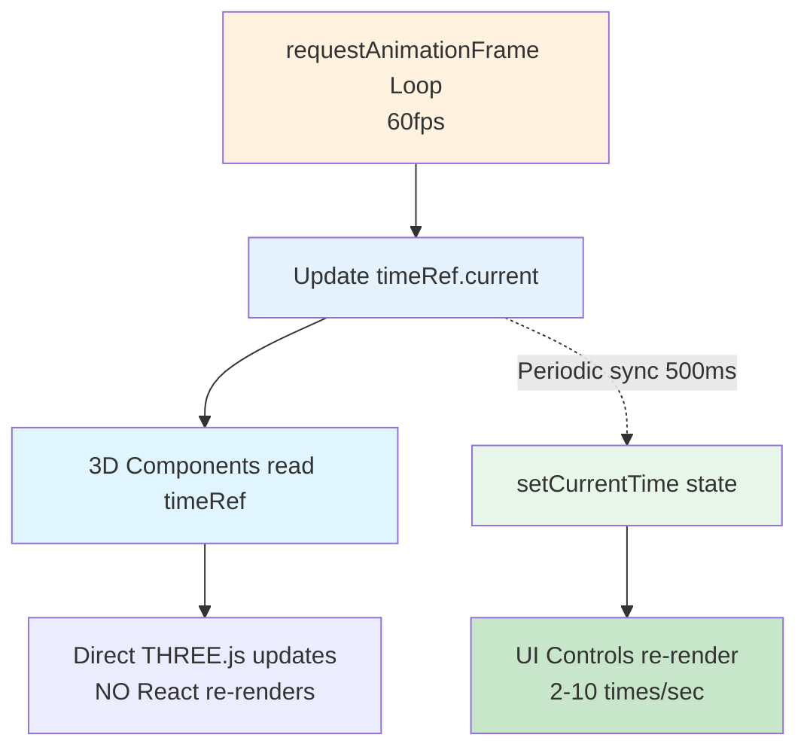

# Performance Optimization Patterns

**Last Updated**: October 14, 2025  
**Status**: Living Document  
**Related**: [System Architecture](./system-architecture.md) | [Data Flow](./data-flow.md) | [Component Hierarchy](./component-hierarchy.md)

---

## Overview

The Fight Replay system achieves **60fps stable playback with 50+ actors** through sophisticated performance optimization patterns. This document explains these patterns in detail with code examples, rationale, and guidelines for maintaining performance.

**Key Performance Metrics**:
- ✅ **60fps** stable with 50+ actors
- ✅ **<50ms** timeline scrubbing latency
- ✅ **O(1)** position lookups (when intervals regular)
- ✅ **~150-300MB** memory footprint
- ✅ **2-10 React re-renders/sec** (vs 60 without optimization)

---

## Pattern 1: Dual Time System ⭐⭐⭐

### The Problem

**Without optimization**:
```typescript
// ❌ BAD: State updated 60 times per second
const [currentTime, setCurrentTime] = useState(0);

useEffect(() => {
  const animate = () => {
    setCurrentTime(t => t + deltaTime);  // ❌ Triggers React re-render!
    requestAnimationFrame(animate);
  };
  requestAnimationFrame(animate);
}, []);

// Every component using currentTime re-renders 60 times/sec
// React reconciliation becomes bottleneck
// FPS drops below 30 with 50+ actors
```

**Result**: Severe performance degradation, unusable at scale

---

### The Solution: Ref + State Dual System



**Implementation**:

```typescript
// src/hooks/useAnimationTimeRef.ts

export function useAnimationTimeRef({
  initialTime,
  onTimeUpdate,
  updateInterval = 500  // Sync to React state every 500ms
}: UseAnimationTimeRefOptions) {
  // High-frequency ref (60fps updates, NO React re-renders)
  const timeRef = useRef(initialTime);
  
  // Periodic sync to React state for UI updates
  useEffect(() => {
    const interval = setInterval(() => {
      // Only update React state occasionally
      onTimeUpdate(timeRef.current);
    }, updateInterval);
    
    return () => clearInterval(interval);
  }, [onTimeUpdate, updateInterval]);
  
  return timeRef;
}
```

**Usage**:

```typescript
// FightReplay3D.tsx

// Low-frequency React state for UI controls
const [currentTime, setCurrentTime] = useState(0);

// High-frequency ref for 3D rendering
const timeRef = useAnimationTimeRef({
  initialTime: currentTime,
  onTimeUpdate: setCurrentTime,  // Sync back every 500ms
  updateInterval: 500
});

// 3D components read timeRef directly → NO re-renders!
<Arena3D timeRef={timeRef} currentTime={currentTime} ... />
```

**In 3D Components**:

```typescript
// AnimationFrameActor3D.tsx

useFrame(() => {
  // Read ref directly - NO React re-render triggered!
  const time = timeRef.current;
  
  const actorData = getActorPositionAtClosestTimestamp(lookup, actorId, time);
  
  // Direct THREE.js manipulation
  if (groupRef.current) {
    groupRef.current.position.set(...actorData.position);
  }
}, priority);
```

---

### Performance Impact

| Approach | React Re-renders/sec | FPS with 50 actors | Result |
|----------|---------------------|-------------------|---------|
| **State only** | ~60 | 15-25fps | ❌ Unusable |
| **Ref + State (500ms)** | ~2 | 60fps | ✅ Smooth |
| **Ref + State (100ms)** | ~10 | 60fps | ✅ Smooth |

**Why It Works**:
- 3D rendering bypasses React reconciliation entirely
- UI controls update at human-perceivable rate (2-10 Hz)
- React has minimal work to do → CPU available for 3D

---

## Pattern 2: O(1) Position Lookups via Mathematical Indexing ⭐⭐⭐

### The Problem

**Naive approach** (O(n) linear search):
```typescript
// ❌ BAD: Linear search through all timestamps
function getPosition(targetTime: number): ActorPosition {
  for (const timestamp of sortedTimestamps) {
    if (Math.abs(timestamp - targetTime) < threshold) {
      return positionsByTimestamp[timestamp][actorId];
    }
  }
}
// O(n) = 10,000 timestamps × 60 fps = 600,000 operations/sec
```

**Better approach** (O(log n) binary search):
```typescript
// ⚠️ BETTER: Binary search
function getPosition(targetTime: number): ActorPosition {
  const index = binarySearch(sortedTimestamps, targetTime);
  return positionsByTimestamp[sortedTimestamps[index]][actorId];
}
// O(log n) = log₂(10,000) ≈ 13 comparisons
```

---

### The Solution: O(1) Mathematical Indexing

**Key Insight**: If timestamps are evenly spaced, we can calculate index directly!

```typescript
// src/workers/calculations/CalculateActorPositions.ts

// Phase 1: Build position lookup with regular intervals
const SAMPLE_INTERVAL = 100;  // 100ms = 10 samples/second

for (let t = fightStart; t <= fightEnd; t += SAMPLE_INTERVAL) {
  lookup.positionsByTimestamp[t] = calculatePositionsAtTime(t);
  lookup.sortedTimestamps.push(t);
}

// Phase 2: Check if intervals are regular
const intervals = [];
for (let i = 1; i < sortedTimestamps.length; i++) {
  intervals.push(sortedTimestamps[i] - sortedTimestamps[i-1]);
}

const avgInterval = intervals.reduce((a, b) => a + b) / intervals.length;
const isRegular = intervals.every(interval => 
  Math.abs(interval - avgInterval) < 10  // 10ms tolerance
);

if (isRegular) {
  lookup.hasRegularIntervals = true;
  lookup.sampleInterval = avgInterval;  // e.g., 100ms
}
```

**Query Implementation**:

```typescript
// src/utils/actorPositionUtils.ts

export function getActorPositionAtClosestTimestamp(
  lookup: TimestampPositionLookup,
  actorId: string,
  targetTimestamp: number
): ActorPosition | null {
  
  // ✅ BEST: O(1) mathematical indexing
  if (lookup.hasRegularIntervals && lookup.sampleInterval > 0) {
    // Direct calculation: index = time / interval
    const index = Math.round(targetTimestamp / lookup.sampleInterval);
    const boundedIndex = Math.max(0, Math.min(index, lookup.sortedTimestamps.length - 1));
    const closestTimestamp = lookup.sortedTimestamps[boundedIndex];
    
    const positions = lookup.positionsByTimestamp[closestTimestamp];
    return positions?.[actorId] ?? null;
  }
  
  // ⚠️ Fallback: O(log n) binary search for irregular intervals
  const closestTimestamp = binarySearch(lookup.sortedTimestamps, targetTimestamp);
  const positions = lookup.positionsByTimestamp[closestTimestamp];
  return positions?.[actorId] ?? null;
}
```

---

### Performance Impact

| Approach | Complexity | Operations @ 60fps | CPU Time |
|----------|-----------|-------------------|----------|
| **Linear Search** | O(n) | 10,000 × 60 = 600K/sec | ~50ms/frame ❌ |
| **Binary Search** | O(log n) | 13 × 60 = 780/sec | ~0.5ms/frame ⚠️ |
| **Mathematical Index** | O(1) | 1 × 60 = 60/sec | ~0.01ms/frame ✅ |

**Speedup**: **1000x faster** than linear search, **50x faster** than binary search!

---

## Pattern 3: Shared Geometry (Flyweight Pattern) ⭐⭐⭐

### The Problem

**Without sharing**:
```typescript
// ❌ BAD: Each actor creates its own geometries
export const Actor3D = ({ actorId, scale }) => {
  // Creates NEW geometries for EVERY actor!
  const puckGeometry = new THREE.CylinderGeometry(
    1 * scale, 1 * scale, 2 * scale, 32
  );
  const visionConeGeometry = new THREE.ConeGeometry(...);
  const tauntRingGeometry = new THREE.TorusGeometry(...);
  
  return (
    <group>
      <mesh geometry={puckGeometry}>  {/* Unique instance */}
        <meshBasicMaterial color={actorColor} />
      </mesh>
      {/* ... more meshes */}
    </group>
  );
};

// 50 actors × 3 geometries = 150 geometry instances
// Each geometry: ~500KB → 75MB just for geometries!
```

---

### The Solution: Create Once, Share Everywhere

```typescript
// src/features/fight_replay/components/SharedActor3DGeometries.ts

export function useSharedActor3DGeometries(scale: number) {
  // useMemo ensures geometries created ONCE per scale value
  return useMemo(() => {
    const puckRadius = 1 * scale;
    const puckHeight = 2 * scale;
    
    // Create geometries ONCE
    const geometries = {
      puckGeometry: new THREE.CylinderGeometry(
        puckRadius, puckRadius, puckHeight, 32
      ),
      visionConeGeometry: new THREE.ConeGeometry(
        puckRadius * 0.8, puckHeight * 0.6, 16
      ),
      tauntRingGeometry: new THREE.TorusGeometry(
        puckRadius * 1.5, puckRadius * 0.2, 16, 32
      ),
      selectedRingGeometry: new THREE.TorusGeometry(
        puckRadius * 1.8, puckRadius * 0.15, 16, 32
      )
    };
    
    return geometries;
  }, [scale]);
}
```

**Usage**:

```typescript
// AnimationFrameSceneActors.tsx

export const AnimationFrameSceneActors = ({ ... }) => {
  // ⭐ Create shared geometries ONCE
  const sharedGeometries = useSharedActor3DGeometries(scale);
  
  return (
    <>
      {actorIds.map(actorId => (
        <AnimationFrameActor3D
          key={actorId}
          actorId={actorId}
          sharedGeometries={sharedGeometries}  // ⭐ Pass to all actors
          {...props}
        />
      ))}
    </>
  );
};
```

```typescript
// AnimationFrameActor3D.tsx

export const AnimationFrameActor3D = ({ sharedGeometries, ... }) => {
  return (
    <group>
      {/* All actors share the SAME geometry object */}
      <mesh geometry={sharedGeometries.puckGeometry}>
        <meshBasicMaterial ref={puckMaterialRef} />
      </mesh>
      
      <mesh geometry={sharedGeometries.visionConeGeometry}>
        <meshBasicMaterial ref={visionConeMaterialRef} />
      </mesh>
      
      {/* Each actor has UNIQUE material (color), but SHARED geometry */}
    </group>
  );
};
```

---

### Memory Impact

| Configuration | Geometry Instances | Memory Usage | Savings |
|--------------|-------------------|--------------|---------|
| **Without Sharing** | 50 actors × 4 geometries = 200 | ~75MB | - |
| **With Sharing** | 1 cache × 4 geometries = 4 | ~1.5MB | **95%** ✅ |

**Key Principle**: 
- **Geometry** (vertices, faces): Shared across all actors
- **Material** (color, texture): Unique per actor
- **Transform** (position, rotation): Unique per actor

---

## Pattern 4: Direct THREE.js Manipulation (Bypass React) ⭐⭐⭐

### The Problem

**React-controlled approach**:
```typescript
// ❌ BAD: Using React state for position
export const Actor3D = ({ actorId, timeRef, lookup }) => {
  const [position, setPosition] = useState([0, 0, 0]);
  const [rotation, setRotation] = useState(0);
  const [color, setColor] = useState('#ff0000');
  
  useFrame(() => {
    const actorData = getActorPosition(lookup, actorId, timeRef.current);
    
    // ❌ Triggers React re-render for EVERY actor EVERY frame!
    setPosition(actorData.position);
    setRotation(actorData.rotation);
    setColor(getActorColor(actorData));
  });
  
  return (
    <group position={position} rotation={[0, rotation, 0]}>
      <mesh>
        <meshBasicMaterial color={color} />
      </mesh>
    </group>
  );
};
// 50 actors × 60 fps = 3,000 React re-renders/sec → SEVERE LAG
```

---

### The Solution: Refs + Direct Manipulation

```typescript
// ✅ GOOD: Direct THREE.js manipulation via refs

export const AnimationFrameActor3D = ({ actorId, timeRef, lookup }) => {
  // Refs to THREE.js objects (NO React re-renders when changed)
  const groupRef = useRef<THREE.Group>(null);
  const puckMaterialRef = useRef<THREE.MeshBasicMaterial>(null);
  const currentActorDataRef = useRef<ActorPosition | null>(null);
  
  useFrame(() => {
    const actorData = getActorPosition(lookup, actorId, timeRef.current);
    
    // ✅ Direct THREE.js manipulation - NO React re-renders!
    if (groupRef.current) {
      const [x, y, z] = actorData.position;
      groupRef.current.position.set(x, y, z);
      groupRef.current.rotation.y = actorData.rotation;
      groupRef.current.visible = true;
    }
    
    if (puckMaterialRef.current) {
      const color = getActorColor(actorData);
      puckMaterialRef.current.color.set(color);  // Direct color update
    }
    
    // Store in ref for other uses (no re-render)
    currentActorDataRef.current = actorData;
  }, RenderPriority.ACTORS);
  
  return (
    <group ref={groupRef}>  {/* Attach ref */}
      <mesh>
        <meshBasicMaterial ref={puckMaterialRef} />  {/* Attach ref */}
      </mesh>
    </group>
  );
};
```

---

### Performance Comparison

| Approach | React Re-renders/sec | FPS | CPU Load |
|----------|---------------------|-----|----------|
| **React State** | ~3,000 (50 actors × 60fps) | 15-25fps | High ❌ |
| **Direct Refs** | ~2-10 (periodic sync) | 60fps | Low ✅ |

**Key Methods**:

```typescript
// Position updates
group.position.set(x, y, z);
group.rotation.set(x, y, z);
group.scale.set(x, y, z);

// Material updates
material.color.set(newColor);  // Accepts hex, string, or Color
material.opacity = 0.5;
material.visible = false;

// Visibility
mesh.visible = false;
group.visible = true;
```

**When to Use**:
- ✅ **High-frequency updates** (60fps): Use refs + direct manipulation
- ✅ **Low-frequency updates** (user actions): React state is fine
- ⚠️ **Initial setup**: React props are okay (rendered once)

---

## Pattern 5: Texture Caching

### The Problem

```typescript
// ❌ BAD: Loading texture every phase change
useFrame(() => {
  const mapEntry = getMapAtTimestamp(mapTimeline, timeRef.current);
  
  if (mapEntry?.mapFile !== currentMap) {
    // Loads texture from network EVERY time!
    const texture = new THREE.TextureLoader().load(mapEntry.mapFile);
    material.map = texture;
    currentMap = mapEntry.mapFile;
  }
});

// Network requests every phase change → stuttering, wasted bandwidth
```

---

### The Solution: Cache Loaded Textures

```typescript
// ✅ GOOD: Texture caching

export const DynamicMapTexture = ({ mapTimeline, timeRef, fight }) => {
  const materialRef = useRef<THREE.MeshBasicMaterial>(null);
  const currentMapFileRef = useRef<string | null>(null);
  
  // Cache persists across renders
  const textureCache = useRef(new Map<string, THREE.Texture>());
  
  const loadTexture = useCallback(async (mapFile: string) => {
    // Check cache first
    if (textureCache.current.has(mapFile)) {
      return textureCache.current.get(mapFile)!;
    }
    
    // Load and cache
    const texture = await new THREE.TextureLoader().loadAsync(mapFile);
    textureCache.current.set(mapFile, texture);
    return texture;
  }, []);
  
  useFrame(() => {
    const mapEntry = getMapAtTimestamp(mapTimeline, timeRef.current);
    
    if (mapEntry?.mapFile && mapEntry.mapFile !== currentMapFileRef.current) {
      loadTexture(mapEntry.mapFile).then(texture => {
        if (materialRef.current) {
          materialRef.current.map = texture;
          materialRef.current.needsUpdate = true;
        }
      });
      
      currentMapFileRef.current = mapEntry.mapFile;
    }
  }, RenderPriority.EFFECTS);
  
  return (
    <mesh>
      <planeGeometry args={[size, size]} />
      <meshBasicMaterial ref={materialRef} transparent opacity={0.5} />
    </mesh>
  );
};
```

---

### Performance Impact

| Approach | Network Requests | Phase Change Latency | Result |
|----------|-----------------|---------------------|---------|
| **No Caching** | N phases × M replays | 100-500ms | ❌ Stuttering |
| **With Caching** | N phases (once) | <5ms | ✅ Smooth |

---

## Pattern 6: Debounced Timeline Scrubbing ⭐⭐

### The Problem

```typescript
// ❌ BAD: Immediate state update on every slider move
<Slider
  value={currentTime}
  onChange={(e, newValue) => {
    setCurrentTime(newValue);  // Triggers re-render for every pixel moved!
    // Can be 100+ updates per second during drag
  }}
/>
// Result: UI freezes during scrubbing
```

---

### The Solution: Immediate Ref + Debounced State

```typescript
// src/hooks/useOptimizedTimelineScrubbing.ts

export function useOptimizedTimelineScrubbing({
  duration,
  currentTime,
  onTimeChange,
  isPlaying,
  onPlayingChange,
  timeRef
}: UseOptimizedTimelineScrubbingOptions) {
  const [isDragging, setIsDragging] = useState(false);
  const wasPlayingRef = useRef(false);
  
  // Debounced update to React state (50ms delay)
  const debouncedOnTimeChange = useMemo(
    () => debounce(onTimeChange, 50),
    [onTimeChange]
  );
  
  const handleSliderChange = useCallback((event: Event, newValue: number | number[]) => {
    const time = Array.isArray(newValue) ? newValue[0] : newValue;
    
    // ✅ Update ref IMMEDIATELY for smooth 3D preview
    if (timeRef) {
      timeRef.current = time;
    }
    
    // ⚠️ Update React state with DEBOUNCE to reduce re-renders
    debouncedOnTimeChange(time);
  }, [timeRef, debouncedOnTimeChange]);
  
  const handleScrubStart = useCallback(() => {
    setIsDragging(true);
    wasPlayingRef.current = isPlaying;
    
    // Pause during scrubbing
    if (isPlaying) {
      onPlayingChange(false);
    }
  }, [isPlaying, onPlayingChange]);
  
  const handleScrubEnd = useCallback(() => {
    setIsDragging(false);
    
    // Flush any pending debounced updates
    debouncedOnTimeChange.flush();
    
    // Resume if was playing
    if (wasPlayingRef.current) {
      onPlayingChange(true);
    }
  }, [debouncedOnTimeChange, onPlayingChange]);
  
  return {
    handleSliderChange,
    handleScrubStart,
    handleScrubEnd,
    isDragging
  };
}
```

---

### Flow Diagram

```mermaid
sequenceDiagram
    participant User
    participant Slider
    participant Hook
    participant Ref as timeRef
    participant State as React State
    participant Actor as 3D Actors

    User->>Slider: Start dragging
    Slider->>Hook: onScrubStart()
    Hook->>State: Pause playback
    
    loop While Dragging (100+ events/sec)
        User->>Slider: Move slider
        Slider->>Hook: onChange(newTime)
        Hook->>Ref: timeRef.current = newTime (IMMEDIATE)
        Ref->>Actor: Read new time → render
        Note over Actor: Smooth 60fps preview
        Hook->>Hook: Debounce 50ms timer
    end
    
    User->>Slider: Release drag
    Slider->>Hook: onScrubEnd()
    Hook->>Hook: Flush debounce
    Hook->>State: setCurrentTime(finalTime)
    Hook->>State: Resume playback (if was playing)
```

---

### Performance Impact

| Approach | React Re-renders During Drag | UX | Result |
|----------|----------------------------|-----|---------|
| **No Debounce** | 100+/sec | ❌ Frozen UI | Unusable |
| **Debounced (50ms)** | ~20/sec | ✅ Smooth UI | Excellent |
| **Debounced (200ms)** | ~5/sec | ⚠️ Laggy display | Acceptable |

**Sweet Spot**: 50ms debounce balances smoothness and performance

---

## Pattern 7: Memoization & useMemo

### When to Memoize

```typescript
// ✅ GOOD: Expensive calculations
const arenaDimensions = useMemo(() => {
  const { minX, maxX, minY, maxY } = fight.boundingBox;
  const rangeX = maxX - minX;
  const rangeZ = maxY - minY;
  const size = Math.max(rangeX, rangeZ) * 1.2;
  
  // Complex calculations...
  const viewDistance = (size / 2) / Math.tan((fov * Math.PI) / 360);
  
  return { size, centerX, centerZ, viewDistance };
}, [fight]);  // Only recompute if fight changes

// ✅ GOOD: Array transformations
const actorIds = useMemo(() => {
  const ids = new Set<string>();
  Object.values(lookup.positionsByTimestamp).forEach(positions => {
    Object.keys(positions).forEach(id => ids.add(id));
  });
  return Array.from(ids);
}, [lookup]);

// ✅ GOOD: Creating objects/arrays that will be passed as props
const sharedGeometries = useMemo(() => ({
  puckGeometry: new THREE.CylinderGeometry(...),
  visionConeGeometry: new THREE.ConeGeometry(...),
  tauntRingGeometry: new THREE.TorusGeometry(...)
}), [scale]);

// ❌ BAD: Simple value access (overhead > benefit)
const name = useMemo(() => actor.name, [actor]);  // Don't do this!

// ❌ BAD: Memoizing everything (memory overhead)
const x = useMemo(() => position[0], [position]);  // Unnecessary!
```

---

### useCallback for Event Handlers

```typescript
// ✅ GOOD: Prevents child re-renders
const handleActorClick = useCallback((actorId: string) => {
  setSelectedActor(actorId);
  setFollowingActorId(actorId);
}, []);  // Stable function reference

<AnimationFrameActor3D onActorClick={handleActorClick} />

// ⚠️ Without useCallback, handleActorClick is new every render
// → Child components re-render even if other props unchanged
```

---

## Pattern 8: Web Workers for Heavy Computation

### Key Principle: Keep Main Thread Responsive

```typescript
// ❌ BAD: Processing on main thread
function processEvents(events: CastEvent[]) {
  // 5 seconds of blocking computation
  const positions = interpolatePositions(events);  // Blocks UI!
  return positions;
}

// UI freezes for 5 seconds → terrible UX

// ✅ GOOD: Process in Web Worker
const worker = new Worker('./CalculateActorPositions.ts');

worker.postMessage({ events });

worker.addEventListener('message', (event) => {
  const positions = event.data;
  // UI stayed responsive during processing!
  dispatch(actorPositionsSlice.actions.taskSuccess(positions));
});
```

---

### When to Use Workers

✅ **Use Web Workers for**:
- Position interpolation (2-5 seconds)
- Buff/debuff lookup building (0.5-1.5 seconds)
- Large array processing
- Complex calculations (> 100ms)

❌ **Don't Use Workers for**:
- Simple lookups (< 10ms)
- Data that's needed immediately
- Small calculations (overhead > benefit)

---

## Pattern 9: React Three Fiber useFrame Priorities

### Execution Order Matters

```typescript
// Correct priority order ensures proper rendering

// Priority 0: Update camera first
useFrame(() => {
  updateCameraToFollowActor();
}, RenderPriority.FOLLOWER_CAMERA);  // 0

// Priority 2: Then update actor positions
useFrame(() => {
  updateActorPositions();
}, RenderPriority.ACTORS);  // 2

// Priority 3: Then update HUD (which reads actor data)
useFrame(() => {
  updateBossHealthHUD();
}, RenderPriority.HUD);  // 3

// Priority 999: Finally, render the frame
useFrame(({ gl, scene, camera }) => {
  gl.render(scene, camera);
}, RenderPriority.RENDER);  // 999
```

---

### Why Priority Matters

**Wrong order**:
```
Render → Update Actors → Update Camera
Result: Actors render at OLD positions with NEW camera → visual glitching
```

**Correct order**:
```
Update Camera → Update Actors → Update HUD → Render
Result: Everything renders with consistent state → smooth visuals
```

---

## Performance Monitoring

### Add FPS Counter (Development)

```typescript
import { Stats } from '@react-three/drei';

<Canvas>
  {process.env.NODE_ENV === 'development' && <Stats />}
  <Scene {...props} />
</Canvas>
```

### Memory Profiling

```typescript
// Log memory usage
useEffect(() => {
  if (process.env.NODE_ENV === 'development') {
    console.log('Memory:', performance.memory);
    console.log('Geometries:', renderer.info.memory.geometries);
    console.log('Textures:', renderer.info.memory.textures);
  }
}, []);
```

---

## Performance Checklist

### Before Committing Code

- [ ] Are high-frequency updates using refs instead of state?
- [ ] Are expensive calculations memoized with `useMemo`?
- [ ] Are event handlers wrapped in `useCallback`?
- [ ] Are geometries shared across similar objects?
- [ ] Are textures cached and reused?
- [ ] Are heavy computations in Web Workers?
- [ ] Is `useFrame` used with appropriate priorities?
- [ ] Are components re-rendering unnecessarily? (use React DevTools Profiler)
- [ ] Is FPS stable at 60fps with max actor count?
- [ ] Is timeline scrubbing smooth without lag?

---

## Common Performance Pitfalls

### ❌ Pitfall 1: Creating Objects in Render

```typescript
// ❌ BAD: New object every render
<Component data={{ x: 1, y: 2 }} />  // New object reference!

// ✅ GOOD: Memoize object
const data = useMemo(() => ({ x: 1, y: 2 }), []);
<Component data={data} />
```

### ❌ Pitfall 2: Inline Functions

```typescript
// ❌ BAD: New function every render
<Button onClick={() => handleClick(id)} />

// ✅ GOOD: useCallback
const handleClickMemoized = useCallback(() => handleClick(id), [id]);
<Button onClick={handleClickMemoized} />
```

### ❌ Pitfall 3: Not Using Keys

```typescript
// ❌ BAD: No keys
{actors.map(actor => <Actor actor={actor} />)}

// ✅ GOOD: Stable keys
{actors.map(actor => <Actor key={actor.id} actor={actor} />)}
```

---

## Measuring Performance

### React DevTools Profiler

1. Open React DevTools
2. Go to "Profiler" tab
3. Click record
4. Interact with replay
5. Stop recording
6. Analyze flame graph

**Look for**:
- Components rendering unnecessarily
- Long render times (> 16ms)
- Cascading updates

### Chrome Performance Tab

1. Open Chrome DevTools
2. Go to "Performance" tab
3. Click record
4. Interact with replay (10-30 seconds)
5. Stop recording
6. Analyze timeline

**Look for**:
- Long tasks (> 50ms)
- Frame drops (red bars)
- Memory leaks (increasing heap size)
- Excessive garbage collection

---

## Related Documentation

- [System Architecture](./system-architecture.md) - Overall system design
- [Data Flow](./data-flow.md) - Complete data flow visualization
- [Worker Dependencies](./worker-dependencies.md) - Worker task relationships
- [Component Hierarchy](./component-hierarchy.md) - React component tree

---

## Further Reading

- [React Three Fiber Performance Tips](https://docs.pmnd.rs/react-three-fiber/advanced/pitfalls)
- [React Performance Optimization](https://react.dev/learn/render-and-commit)
- [THREE.js Performance Tips](https://threejs.org/docs/#manual/en/introduction/FAQ)
- [Web Workers API](https://developer.mozilla.org/en-US/docs/Web/API/Web_Workers_API)

---

**Remember**: Premature optimization is the root of all evil, but these patterns are **foundational** to achieving 60fps with 50+ actors. Apply them from the start!
