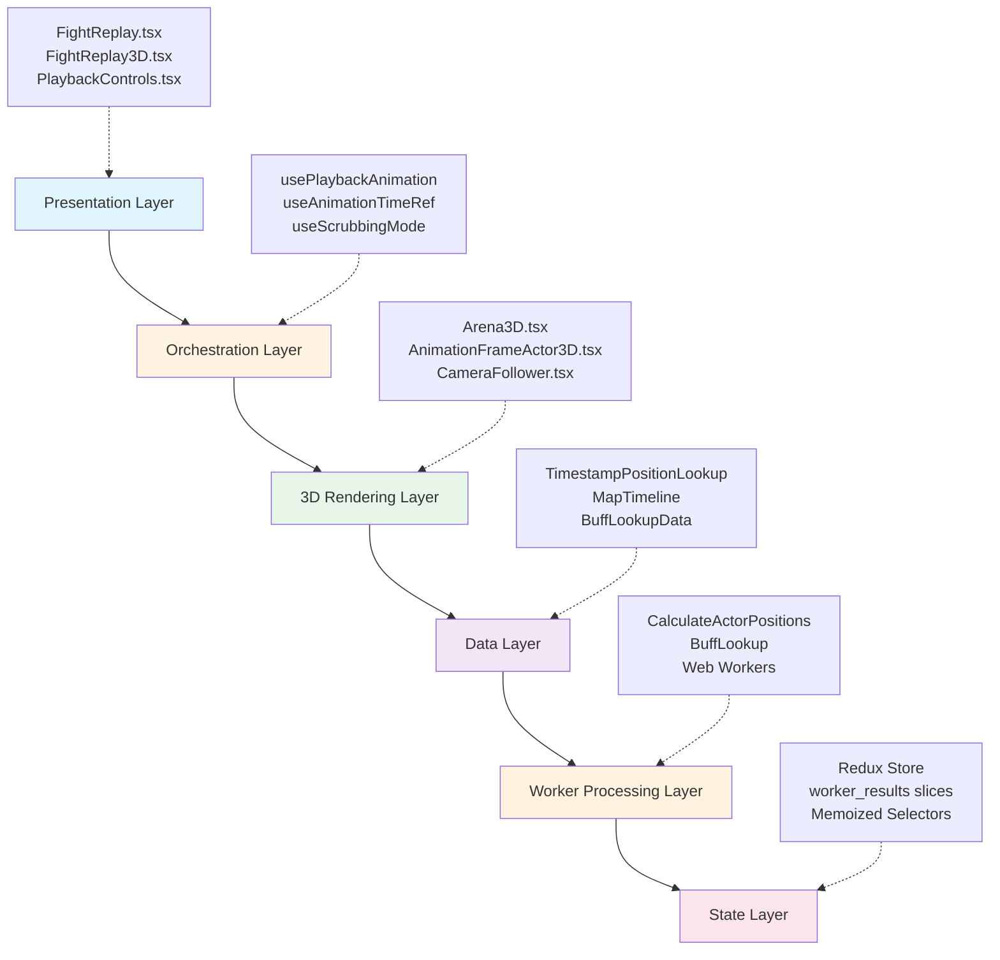
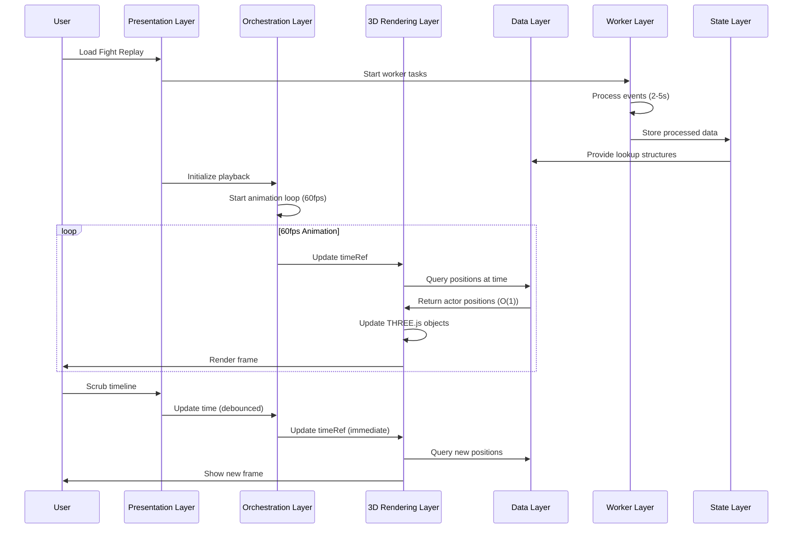

# Replay System Architecture

**Last Updated**: October 14, 2025  
**Status**: Living Document  
**Related**: [Data Flow](./data-flow.md) | [Worker Dependencies](./worker-dependencies.md) | [Component Hierarchy](./component-hierarchy.md) | [Performance Patterns](./performance-patterns.md)

---

## Overview

The ESO Log Aggregator Fight Replay System is a sophisticated 3D visualization engine that renders combat encounters in real-time at 60fps. The architecture is designed around **high-performance rendering** requirements while maintaining React's declarative programming model.

**Key Performance Metrics**:
- ✅ **60fps** stable playback with 50+ actors
- ✅ **<50ms** timeline scrubbing latency  
- ✅ **O(1)** position lookups via pre-computed indexing
- ✅ **~150-300MB** memory footprint with geometry sharing

---

## Six-Layer Architecture

The system is organized into six distinct layers, each with clear responsibilities and boundaries:



---

## Layer Details

### 1. Presentation Layer

**Purpose**: User interface and user experience

**Components**:
- `FightReplay.tsx` - Entry point, layout, controls container
- `FightReplay3D.tsx` - Main orchestrator, data fetching, worker coordination
- `PlaybackControls.tsx` - Timeline, play/pause, speed controls, sharing

**Responsibilities**:
- Render UI controls
- Handle user input events
- Manage layout and responsive design
- Coordinate between 3D scene and controls
- Deep linking and URL state management

**Key Props Flow**:
```typescript
FightReplay
  ├─ reportId: string
  ├─ fightId: string
  └─ FightReplay3D
      ├─ fight: FightFragment
      ├─ events: { casts, damage, healing, death, resource }
      └─ Arena3D + PlaybackControls
```

---

### 2. Orchestration Layer

**Purpose**: Coordinate high-frequency (60fps) and low-frequency (React) updates

**Custom Hooks**:
- `usePlaybackAnimation` - Manages smooth playback via requestAnimationFrame
- `useAnimationTimeRef` - Dual time system (ref + state)
- `useScrubbingMode` - Optimizes rendering during timeline scrubbing
- `useOptimizedTimelineScrubbing` - Debounced timeline updates

**Responsibilities**:
- Decouple 3D rendering from React re-renders
- Synchronize animation time with UI state
- Optimize performance during interactions
- Manage playback state (playing, paused, speed)

**Key Innovation - Dual Time System**:
```typescript
// Low-frequency React state (~2-10 updates/sec)
const [currentTime, setCurrentTime] = useState(0);

// High-frequency ref (~60 updates/sec)
const timeRef = useRef(0);

// useFrame reads timeRef directly → No React re-renders!
useFrame(() => {
  const time = timeRef.current; // 60fps, no state updates
  // Update 3D positions...
}, priority);
```

---

### 3. 3D Rendering Layer

**Purpose**: React Three Fiber scene, actors, camera, and HUD

**Components**:
- `Arena3D.tsx` - Canvas wrapper, scene container (633 lines)
- `AnimationFrameActor3D.tsx` - Individual actor rendering
- `CameraFollower.tsx` - Camera following system
- `DynamicMapTexture.tsx` - Phase-aware map textures
- `BossHealthHUD.tsx` - Screen-space boss health display
- `SharedActor3DGeometries.ts` - Shared geometry pattern (95% memory reduction)

**Render Priority System**:
```typescript
enum RenderPriority {
  FOLLOWER_CAMERA = 0,  // Camera updates first
  CAMERA = 1,           // Camera controls
  ACTORS = 2,           // Actor positions
  HUD = 3,              // UI overlays
  EFFECTS = 4,          // Visual effects
  RENDER = 999          // Manual render call (LAST)
}
```

**Responsibilities**:
- Render 3D scene at 60fps
- Update actor positions without React re-renders
- Follow selected actors with smooth camera
- Switch map textures based on phase
- Display boss health in screen space
- Render M0R markers (optional)

**Performance Optimization**:
- ✅ Shared geometries across all actors (3 geometries total instead of 3N)
- ✅ Direct THREE.js material/position updates (no React)
- ✅ Texture caching (one load per map)
- ✅ Priority-based rendering order
- ✅ Frame skipping during scrubbing

---

### 4. Data Layer

**Purpose**: Pre-computed data structures for fast runtime lookups

**Data Structures**:

#### **TimestampPositionLookup**
```typescript
interface TimestampPositionLookup {
  positionsByTimestamp: Record<timestamp, Record<actorId, ActorPosition>>;
  sortedTimestamps: number[];
  sampleInterval: number;
  hasRegularIntervals: boolean;  // Enables O(1) lookups!
}

interface ActorPosition {
  position: [x, y, z];
  rotation: number;
  type: 'player' | 'boss' | 'add';
  isDead: boolean;
  isTaunted: boolean;
  health: number;
  maxHealth: number;
}
```

**O(1) Lookup Strategy**:
```typescript
// When intervals are regular, use mathematical indexing
if (lookup.hasRegularIntervals) {
  const index = Math.round(targetTimestamp / lookup.sampleInterval);
  const timestamp = lookup.sortedTimestamps[index];
  return lookup.positionsByTimestamp[timestamp][actorId];
}
// Otherwise, O(log n) binary search
```

#### **MapTimeline**
```typescript
interface MapTimeline {
  entries: MapTimelineEntry[];
  totalMaps: number;
}

interface MapTimelineEntry {
  mapId: number;
  startTime: number;  // Relative to fight start
  endTime: number;
  mapFile?: string;
  mapName?: string;
}
```

#### **BuffLookupData**
```typescript
interface BuffLookupData {
  buffsByTimestamp: Record<timestamp, BuffState[]>;
  buffTransitions: BuffTransition[];
}
```

**Responsibilities**:
- Provide O(1) or O(log n) lookups during playback
- Pre-compute all derived data upfront
- Cache expensive calculations
- Minimize runtime computation

---

### 5. Worker Processing Layer

**Purpose**: Heavy computation in background threads

**Web Workers**:
- `CalculateActorPositions.ts` - Interpolate positions from cast events
- `CalculateBuffLookup.ts` - Build buff state lookup tables
- `CalculateDebuffLookup.ts` - Build debuff state lookup tables

**Worker Task Pattern**:
```typescript
// Generic factory for consistent worker task handling
const actorPositionsSlice = createWorkerTaskSlice({
  name: 'actorPositions',
  taskFn: executeActorPositionsTask,
  initialState: {
    data: null,
    loading: false,
    error: null,
    progress: null
  }
});
```

**Processing Pipeline**:
```
Event Data (100k-500k events)
  ↓
executeActorPositionsTask()
  ↓
Web Worker: CalculateActorPositions.ts
  ├─ Interpolate positions between cast events
  ├─ Detect actor types (player/boss/add)
  ├─ Calculate rotations from movement
  ├─ Build timestamp index
  └─ Optimize for O(1) lookups
  ↓
TimestampPositionLookup (10-50MB)
  ↓
Redux Store (actorPositionsSlice)
```

**Responsibilities**:
- Keep main thread responsive during processing
- Report progress for long-running tasks
- Handle errors gracefully
- Enable task cancellation
- Build optimized data structures

**Task Dependencies**:
- `debuffLookup` → depends on buff events
- `actorPositions` → depends on cast events + debuffLookup (taunt detection)
- `mapTimeline` → depends on buff events (phase detection)

---

### 6. State Layer

**Purpose**: Redux store for application state

**Redux Slices**:
```
src/store/worker_results/
  ├── actorPositionsSlice.ts     // TimestampPositionLookup
  ├── buffLookupSlice.ts         // BuffLookupData  
  ├── debuffLookupSlice.ts       // DebuffLookupData
  ├── workerTaskSliceFactory.ts  // Generic worker pattern
  └── selectors.ts               // Memoized selectors
```

**Selector Pattern**:
```typescript
// Memoized selector prevents unnecessary re-renders
export const selectActorPositionsData = createSelector(
  [(state) => state.workerResults.actorPositions.data],
  (data) => data
);

// Used in components
const lookup = useSelector(selectActorPositionsData);
```

**Responsibilities**:
- Store worker computation results
- Provide memoized selectors
- Track loading/error states
- Enable progress reporting
- Persist state (optional via Redux Persist)

---

## Cross-Cutting Concerns

### Time Management

The system uses **two parallel time representations**:

1. **React State** (Low-Frequency)
   - Updates: 2-10 times per second
   - Used for: UI controls, timeline display
   - Source: `useState(currentTime)`

2. **Animation Ref** (High-Frequency)
   - Updates: 60 times per second
   - Used for: 3D rendering, smooth playback
   - Source: `useRef(timeRef)`

**Synchronization**:
```typescript
// useAnimationTimeRef
useEffect(() => {
  const interval = setInterval(() => {
    // Sync ref → state every 500ms
    onTimeUpdate(timeRef.current);
  }, updateInterval);
  return () => clearInterval(interval);
}, []);
```

### Memory Management

**Shared Geometry Pattern**:
```typescript
// Instead of: 50 actors × 3 geometries = 150 geometry instances
// We have: 1 cache × 3 geometries = 3 geometry instances

const { puckGeometry, visionConeGeometry, tauntRingGeometry } = 
  useSharedActor3DGeometries(scale);

// Each actor references the SAME geometry
<mesh geometry={puckGeometry} material={actorMaterial} />
```

**Texture Caching**:
```typescript
// DynamicMapTexture.tsx
const textureCache = new Map<string, THREE.Texture>();

function loadTexture(mapFile: string) {
  if (textureCache.has(mapFile)) {
    return Promise.resolve(textureCache.get(mapFile));
  }
  // Load and cache...
}
```

### Error Handling

**Current Implementation**:
- ✅ Worker task errors captured in Redux state
- ✅ Loading states shown in UI
- ✅ TypeScript prevents type errors

**Recommended Additions** (Priority 1):
- ⚠️ React Error Boundaries around 3D components
- ⚠️ WebGL support detection with fallback
- ⚠️ Retry logic for failed worker tasks
- ⚠️ User-friendly error messages

---

## Data Flow Summary



---

## Architecture Benefits

### ✅ Strengths

1. **Performance**: 60fps with 50+ actors through clever optimizations
2. **Separation of Concerns**: Clear layer boundaries, minimal coupling
3. **Scalability**: Pre-computed lookups handle large fights efficiently
4. **Maintainability**: TypeScript, custom hooks hide complexity
5. **Responsiveness**: Worker-based processing keeps UI interactive

### ⚠️ Areas for Improvement

1. **Complexity**: High cognitive load with multiple `useFrame` hooks
2. **Testing**: Missing integration tests for data flow
3. **Documentation**: Architecture diagrams were missing (now added!)
4. **Error Recovery**: Limited retry/fallback mechanisms

---

## Key Files Reference

### Entry Points
- `src/features/fight_replay/FightReplay.tsx`
- `src/features/fight_replay/components/FightReplay3D.tsx`

### Performance-Critical
- `src/workers/calculations/CalculateActorPositions.ts`
- `src/features/fight_replay/components/AnimationFrameActor3D.tsx`
- `src/features/fight_replay/components/SharedActor3DGeometries.ts`
- `src/hooks/useAnimationTimeRef.ts`

### Data Structures
- `src/types/TimestampPositionLookup.ts`
- `src/types/MapTimeline.ts`
- `src/utils/mapTimelineUtils.ts`

### State Management
- `src/store/worker_results/actorPositionsSlice.ts`
- `src/store/worker_results/workerTaskSliceFactory.ts`

---

## Related Documentation

- [Data Flow Diagram](./data-flow.md) - Detailed data flow visualization
- [Worker Dependencies](./worker-dependencies.md) - Worker task dependency graph
- [Component Hierarchy](./component-hierarchy.md) - React component tree
- [Performance Patterns](./performance-patterns.md) - Optimization techniques

---

**Next Steps**: See [REPLAY_SYSTEM_IMPLEMENTATION_PLAN.md](../../REPLAY_SYSTEM_IMPLEMENTATION_PLAN.md) for planned improvements.
