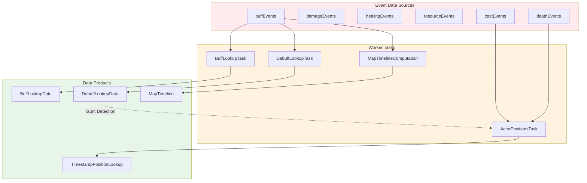
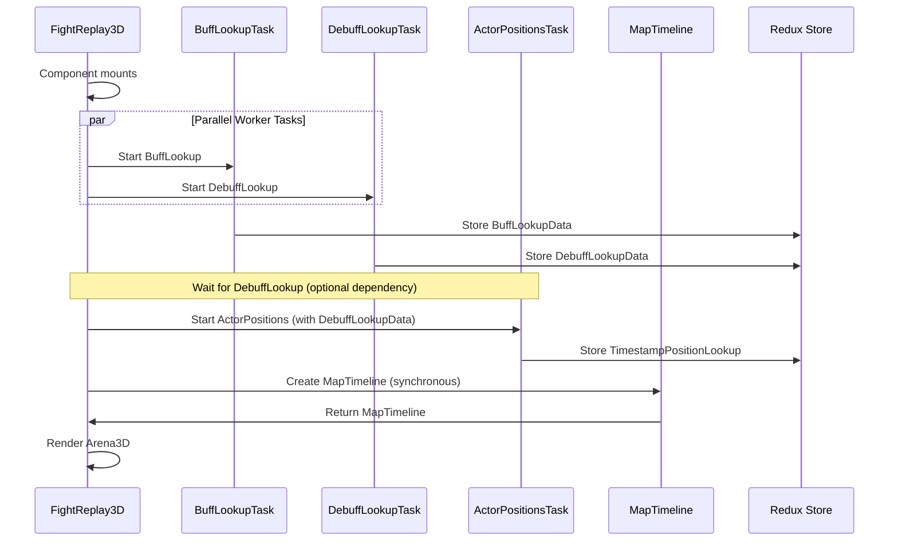
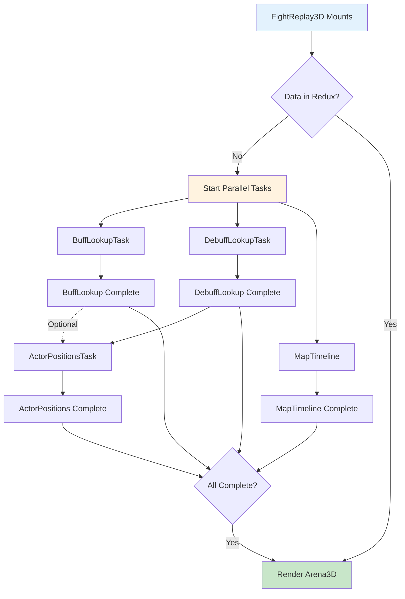

# Worker Task Dependencies

**Last Updated**: October 14, 2025  
**Status**: Living Document  
**Related**: [System Architecture](./system-architecture.md) | [Data Flow](./data-flow.md) | [Component Hierarchy](./component-hierarchy.md)

---

## Overview

The Fight Replay system uses Web Workers for heavy computation to keep the main thread responsive. This document maps out all worker tasks, their dependencies, execution order, and data requirements.

---

## Worker Task Dependency Graph



**Legend**:
- **Solid lines**: Required dependencies
- **Dotted lines**: Optional dependencies (enhances data if available)

---

## Task Details

### 1. Buff Lookup Task

**Purpose**: Build fast lookup table for buff states at any timestamp

**File**: `src/workers/calculations/CalculateBuffLookup.ts`

**Hook**: `src/hooks/workerTasks/useBuffLookupTask.ts`

**Redux Slice**: `src/store/worker_results/buffLookupSlice.ts`

#### Dependencies
```mermaid
graph LR
    A[buffEvents: BuffEvent[]] --> B[CalculateBuffLookup Worker]
    B --> C[BuffLookupData]
    
    style A fill:#ffebee
    style B fill:#fff3e0
    style C fill:#e8f5e9
```

#### Input
```typescript
interface BuffEvent {
  id: string;
  timestamp: number;
  targetActorId: string;
  abilityId: number;
  abilityName: string;
  type: 'gained' | 'faded';
}
```

#### Output
```typescript
interface BuffLookupData {
  buffsByTimestamp: Record<timestamp, BuffState[]>;
  buffTransitions: BuffTransition[];
}

interface BuffState {
  abilityId: number;
  abilityName: string;
  startTime: number;
  endTime?: number;
  actorId: string;
}
```

#### Processing Steps
1. Sort buff events by timestamp
2. Track active buffs per actor
3. Create timestamp snapshots
4. Build transition markers
5. Index for O(log n) lookups

#### Execution Time
- Small fights (<10 actors): ~100-300ms
- Large fights (50+ actors): ~500-1500ms

---

### 2. Debuff Lookup Task

**Purpose**: Build fast lookup table for debuff states (includes taunt detection)

**File**: `src/workers/calculations/CalculateDebuffLookup.ts`

**Hook**: `src/hooks/workerTasks/useDebuffLookupTask.ts`

**Redux Slice**: `src/store/worker_results/debuffLookupSlice.ts`

#### Dependencies
```mermaid
graph LR
    A[buffEvents: BuffEvent[]] --> B[CalculateDebuffLookup Worker]
    B --> C[DebuffLookupData]
    
    style A fill:#ffebee
    style B fill:#fff3e0
    style C fill:#e8f5e9
```

#### Input
```typescript
// Same as BuffLookupTask - filters for debuff type events
interface BuffEvent {
  type: 'gained' | 'faded';
  isDebuff: boolean;  // Filtered to true
}
```

#### Output
```typescript
interface DebuffLookupData {
  debuffsByTimestamp: Record<timestamp, DebuffState[]>;
  debuffTransitions: DebuffTransition[];
  tauntStates: Record<actorId, TauntPeriod[]>;  // ⭐ Used by ActorPositions
}

interface TauntPeriod {
  actorId: string;
  startTime: number;
  endTime: number;
  tauntAbilityId: number;
}
```

#### Special Feature: Taunt Detection
```typescript
// Detects common taunt abilities
const TAUNT_ABILITY_IDS = [
  38254,  // Pierce Armor
  38455,  // Puncture
  // ... more taunt abilities
];

function detectTaunts(buffEvents: BuffEvent[]): TauntPeriod[] {
  const taunts: TauntPeriod[] = [];
  
  for (const event of buffEvents) {
    if (TAUNT_ABILITY_IDS.includes(event.abilityId)) {
      if (event.type === 'gained') {
        taunts.push({
          actorId: event.targetActorId,
          startTime: event.timestamp,
          endTime: event.timestamp + 15000,  // 15s default duration
          tauntAbilityId: event.abilityId
        });
      }
    }
  }
  
  return taunts;
}
```

#### Execution Time
- Small fights: ~100-300ms
- Large fights: ~500-1500ms

---

### 3. Actor Positions Task ⭐

**Purpose**: Interpolate actor positions for every timestamp, enabling smooth 60fps replay

**File**: `src/workers/calculations/CalculateActorPositions.ts`

**Hook**: `src/hooks/workerTasks/useActorPositionsTask.ts`

**Redux Slice**: `src/store/worker_results/actorPositionsSlice.ts`

#### Dependencies
```mermaid
graph TD
    A[castEvents: CastEvent[]] --> D[CalculateActorPositions Worker]
    B[deathEvents: DeathEvent[]] --> D
    C[DebuffLookupData] -.Optional: Taunt Detection.-> D
    
    D --> E[TimestampPositionLookup]
    
    style A fill:#ffebee
    style B fill:#ffebee
    style C fill:#e8f5e9
    style D fill:#fff3e0
    style E fill:#e8f5e9
```

**Dependency Notes**:
- ✅ **castEvents**: REQUIRED - Contains position data (x, y, z)
- ✅ **deathEvents**: REQUIRED - Marks actors as dead
- ⚠️ **debuffLookup**: OPTIONAL - Enhances visualization with taunt rings

#### Input
```typescript
interface CalculateActorPositionsInput {
  castEvents: CastEvent[];
  deathEvents: DeathEvent[];
  fight: FightFragment;
  debuffLookup?: DebuffLookupData;  // Optional
}
```

#### Output
```typescript
interface TimestampPositionLookup {
  positionsByTimestamp: Record<timestamp, Record<actorId, ActorPosition>>;
  sortedTimestamps: number[];
  sampleInterval: number;
  hasRegularIntervals: boolean;  // Enables O(1) lookups!
}

interface ActorPosition {
  position: [x: number, y: number, z: number];
  rotation: number;
  type: 'player' | 'boss' | 'add';
  isDead: boolean;
  isTaunted: boolean;  // ⭐ From debuffLookup
  health: number;
  maxHealth: number;
  name: string;
}
```

#### Processing Steps

**Phase 1: Actor Registry**
```typescript
const actorRegistry = new Map<actorId, ActorMetadata>();

for (const event of castEvents) {
  if (!actorRegistry.has(event.sourceActorId)) {
    const actorType = detectActorType(event);  // player/boss/add
    actorRegistry.set(event.sourceActorId, {
      id: event.sourceActorId,
      name: event.sourceActorName,
      type: actorType,
      firstSeen: event.timestamp,
      lastSeen: event.timestamp,
      positions: []  // Will store position samples
    });
  }
}
```

**Phase 2: Position Sampling**
```typescript
// Extract positions from cast events
for (const event of castEvents) {
  if (event.x !== undefined && event.y !== undefined) {
    const actor = actorRegistry.get(event.sourceActorId);
    actor.positions.push({
      timestamp: event.timestamp,
      x: event.x,
      y: event.y,
      z: event.z || 0,
      health: event.sourceHealth,
      maxHealth: event.sourceMaxHealth
    });
  }
}
```

**Phase 3: Interpolation**
```typescript
const SAMPLE_INTERVAL = 100;  // 100ms = 10 samples/second

for (let t = fightStart; t <= fightEnd; t += SAMPLE_INTERVAL) {
  const positions: Record<actorId, ActorPosition> = {};
  
  for (const [actorId, actor] of actorRegistry) {
    const before = findPositionBefore(actor, t);
    const after = findPositionAfter(actor, t);
    
    if (before && after) {
      // Linear interpolation
      const ratio = (t - before.timestamp) / (after.timestamp - before.timestamp);
      const x = lerp(before.x, after.x, ratio);
      const y = lerp(before.y, after.y, ratio);
      const z = lerp(before.z, after.z, ratio);
      
      // Calculate rotation from movement direction
      const dx = after.x - before.x;
      const dy = after.y - before.y;
      const rotation = Math.atan2(dy, dx);
      
      // Check if taunted at this time
      const isTaunted = debuffLookup 
        ? checkIfTaunted(actorId, t, debuffLookup)
        : false;
      
      // Check if dead at this time
      const isDead = isDeadAtTime(actorId, t, deathEvents);
      
      positions[actorId] = {
        position: [x, y, z],
        rotation,
        type: actor.type,
        isDead,
        isTaunted,
        health: interpolateHealth(before, after, ratio),
        maxHealth: actor.maxHealth,
        name: actor.name
      };
    }
  }
  
  lookup.positionsByTimestamp[t] = positions;
  lookup.sortedTimestamps.push(t);
}
```

**Phase 4: Index Optimization**
```typescript
// Check if intervals are regular for O(1) lookups
const intervals = [];
for (let i = 1; i < sortedTimestamps.length; i++) {
  intervals.push(sortedTimestamps[i] - sortedTimestamps[i-1]);
}

const avgInterval = intervals.reduce((a, b) => a + b) / intervals.length;
const isRegular = intervals.every(interval => 
  Math.abs(interval - avgInterval) < 10  // 10ms tolerance
);

if (isRegular) {
  lookup.hasRegularIntervals = true;
  lookup.sampleInterval = avgInterval;
  // Now queries can use: index = Math.round(timestamp / interval)
}
```

#### Execution Time
- Small fights (<10 actors, <5min): ~500ms-1s
- Medium fights (20-30 actors, 5-10min): ~1-2s
- Large fights (50+ actors, 10-20min): ~3-5s

---

### 4. Map Timeline Computation

**Purpose**: Determine which map texture to show at each point in time (phase-aware)

**File**: `src/utils/mapTimelineUtils.ts` (not a Web Worker - computed synchronously)

**Hook**: `src/hooks/usePhaseBasedMap.ts`

#### Dependencies
```mermaid
graph LR
    A[buffEvents: BuffEvent[]] --> B[createEnhancedPhaseTransitions]
    C[fight: FightFragment] --> B
    D[report.availableMaps] --> B
    
    B --> E[createMapTimeline]
    E --> F[MapTimeline]
    
    style A fill:#ffebee
    style B fill:#fff3e0
    style E fill:#fff3e0
    style F fill:#e8f5e9
```

#### Input
```typescript
interface MapTimelineInput {
  fight: FightFragment;
  report: ReportFragment;
  buffEvents: BuffEvent[];
}
```

#### Output
```typescript
interface MapTimeline {
  entries: MapTimelineEntry[];
  totalMaps: number;
}

interface MapTimelineEntry {
  mapId: number;
  startTime: number;  // Relative to fight start
  endTime: number;
  mapFile?: string;
  mapName?: string;
}
```

#### Processing Steps

**Phase Detection**:
```typescript
function createEnhancedPhaseTransitions(
  fight: FightFragment,
  report: ReportFragment,
  buffEvents: BuffEvent[]
): PhaseTransition[] {
  const transitions: PhaseTransition[] = [];
  
  // Common phase marker buffs
  const PHASE_MARKER_ABILITIES = [
    123456,  // Boss Phase 2 Buff
    789012,  // Boss Phase 3 Buff
    // ...
  ];
  
  for (const event of buffEvents) {
    if (PHASE_MARKER_ABILITIES.includes(event.abilityId)) {
      transitions.push({
        timestamp: event.timestamp,
        fromPhase: getCurrentPhase(event.timestamp),
        toPhase: getNextPhase(),
        mapId: getMapForPhase(toPhase)
      });
    }
  }
  
  return transitions;
}
```

**Timeline Creation**:
```typescript
function createMapTimeline(
  fight: FightFragment,
  availableMaps: Map[],
  phaseTransitions: PhaseTransition[]
): MapTimeline {
  const entries: MapTimelineEntry[] = [];
  
  let currentTime = 0;  // Relative to fight start
  let currentMapId = fight.startMapId;
  
  for (const transition of phaseTransitions) {
    // Create entry for previous map
    entries.push({
      mapId: currentMapId,
      startTime: currentTime,
      endTime: transition.timestamp - fight.startTime,
      mapFile: findMapFile(currentMapId, availableMaps),
      mapName: findMapName(currentMapId, availableMaps)
    });
    
    currentTime = transition.timestamp - fight.startTime;
    currentMapId = transition.mapId;
  }
  
  // Final entry (last map to end of fight)
  entries.push({
    mapId: currentMapId,
    startTime: currentTime,
    endTime: fight.endTime - fight.startTime,
    mapFile: findMapFile(currentMapId, availableMaps),
    mapName: findMapName(currentMapId, availableMaps)
  });
  
  return {
    entries,
    totalMaps: new Set(entries.map(e => e.mapId)).size
  };
}
```

#### Execution Time
- All fights: ~10-50ms (fast, synchronous)

---

## Execution Order

### Sequential Execution (Current Implementation)



### Recommended: Parallel Execution with Dependency Management



---

## Worker Task Factory Pattern

All worker tasks use a consistent pattern for state management:

```typescript
// src/store/worker_results/workerTaskSliceFactory.ts

export function createWorkerTaskSlice<TData>({
  name,
  initialState,
}: {
  name: string;
  initialState?: Partial<WorkerTaskState<TData>>;
}) {
  return createSlice({
    name,
    initialState: {
      data: null,
      loading: false,
      error: null,
      progress: null,
      ...initialState,
    },
    reducers: {
      taskStarted(state) {
        state.loading = true;
        state.error = null;
        state.progress = 0;
      },
      taskProgress(state, action: PayloadAction<number>) {
        state.progress = action.payload;
      },
      taskSuccess(state, action: PayloadAction<TData>) {
        state.data = action.payload;
        state.loading = false;
        state.error = null;
        state.progress = 100;
      },
      taskFailed(state, action: PayloadAction<string>) {
        state.loading = false;
        state.error = action.payload;
        state.progress = null;
      },
    },
  });
}
```

**Usage**:
```typescript
// actorPositionsSlice.ts
export const actorPositionsSlice = createWorkerTaskSlice<TimestampPositionLookup>({
  name: 'actorPositions',
});

// buffLookupSlice.ts
export const buffLookupSlice = createWorkerTaskSlice<BuffLookupData>({
  name: 'buffLookup',
});
```

---

## Progress Reporting

Workers can report progress for long-running tasks:

```typescript
// In worker: CalculateActorPositions.ts

self.postMessage({
  type: 'progress',
  progress: Math.round((processedActors / totalActors) * 100)
});

// In task executor: executeActorPositionsTask.ts

worker.addEventListener('message', (event) => {
  if (event.data.type === 'progress') {
    store.dispatch(actorPositionsSlice.actions.taskProgress(event.data.progress));
  }
});
```

**UI Display**:
```typescript
// FightReplay3D.tsx

const progress = useSelector(selectActorPositionsProgress);

if (progress !== null && progress < 100) {
  return <LoadingSpinner progress={progress} message="Processing positions..." />;
}
```

---

## Error Handling

```typescript
// In worker

try {
  const result = processData(input);
  self.postMessage({ type: 'success', data: result });
} catch (error) {
  self.postMessage({ 
    type: 'error', 
    error: error.message || 'Unknown error' 
  });
}

// In task executor

worker.addEventListener('message', (event) => {
  if (event.data.type === 'error') {
    store.dispatch(actorPositionsSlice.actions.taskFailed(event.data.error));
  }
});

worker.addEventListener('error', (error) => {
  store.dispatch(actorPositionsSlice.actions.taskFailed(
    `Worker error: ${error.message}`
  ));
});
```

---

## Worker Pool (Future Enhancement)

**Current**: New worker instance for each task  
**Recommended**: Worker pool for reusability

```typescript
// Pseudocode for worker pool

class WorkerPool {
  private workers: Worker[] = [];
  private taskQueue: Task[] = [];
  
  constructor(workerScript: string, poolSize: number = 4) {
    for (let i = 0; i < poolSize; i++) {
      this.workers.push(new Worker(workerScript));
    }
  }
  
  async execute<T>(task: Task): Promise<T> {
    const worker = await this.getAvailableWorker();
    return this.runTask(worker, task);
  }
  
  private async getAvailableWorker(): Promise<Worker> {
    // Return idle worker or wait for one
  }
}

// Usage
const positionsPool = new WorkerPool('./CalculateActorPositions.js', 2);
const result = await positionsPool.execute(task);
```

**Benefits**:
- Reduced worker startup overhead
- Better resource management
- Automatic task queuing

---

## Optimization Opportunities

### 1. Parallel Independent Tasks

✅ **Can run in parallel**:
- BuffLookupTask
- DebuffLookupTask  
- MapTimeline (sync)

⚠️ **Must run after DebuffLookup**:
- ActorPositionsTask (optional dependency for taunt data)

### 2. Transferable Objects

Use transferable objects for large arrays to avoid serialization:

```typescript
// Current: Serializes data (slow for large arrays)
worker.postMessage({ castEvents });

// Recommended: Transfer ownership (zero-copy)
const castEventsBuffer = castEvents.buffer;
worker.postMessage({ castEvents }, [castEventsBuffer]);
```

### 3. Incremental Processing

Instead of processing entire fight upfront, process in chunks:

```typescript
// Process first 30 seconds immediately
// Process rest in background
// Show "Loading more data..." during extended parts
```

---

## Memory Considerations

| Worker Task | Input Size | Output Size | Peak Memory |
|-------------|------------|-------------|-------------|
| BuffLookup | 10-50KB | 500KB-2MB | ~10MB |
| DebuffLookup | 10-50KB | 500KB-2MB | ~10MB |
| ActorPositions | 50-500KB | 10-50MB | ~100MB |
| MapTimeline | 1-10KB | <100KB | ~1MB |

**Total**: ~120MB peak during processing, ~60MB after cleanup

---

## Testing Worker Tasks

```typescript
// Example test for ActorPositionsTask

describe('CalculateActorPositions', () => {
  it('should interpolate positions correctly', async () => {
    const input = {
      castEvents: mockCastEvents,
      deathEvents: [],
      fight: mockFight,
    };
    
    const result = await executeActorPositionsTask(input);
    
    expect(result.sortedTimestamps).toHaveLength(expectedLength);
    expect(result.hasRegularIntervals).toBe(true);
    expect(result.sampleInterval).toBe(100);
  });
  
  it('should detect actor types correctly', async () => {
    // Test boss vs player detection
  });
  
  it('should handle taunt detection when debuffLookup provided', async () => {
    // Test taunt ring display
  });
});
```

---

## Related Documentation

- [System Architecture](./system-architecture.md) - Overall system design
- [Data Flow](./data-flow.md) - Complete data flow visualization
- [Component Hierarchy](./component-hierarchy.md) - React component tree
- [Performance Patterns](./performance-patterns.md) - Optimization techniques

---

**For Implementation**: See `src/workers/calculations/` and `src/hooks/workerTasks/`
